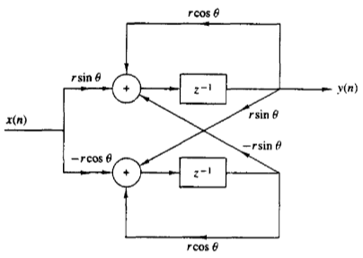

1. For the following system, draw the implementation structures **Direct-Form I**, **Direct-Form II**, **Direct-Form I Transposed**, **Direct-Form II Transposed**, and one of the **series** structures:
$$H(z) = \frac{1 - 2z^{-1} + z^{-2}}{1 + 2z^{-1} + z^{-2}} = \frac{(1 - z^{-1})^2}{(1 + z^{-1})^2}$$

2. Find the system function $H(z)$ for the following system.
(*Hint: give names to some signals*)

{#id .class width=75%}
