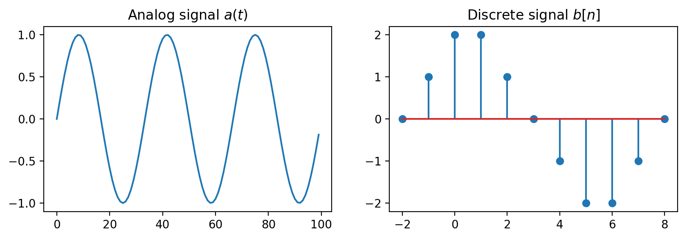
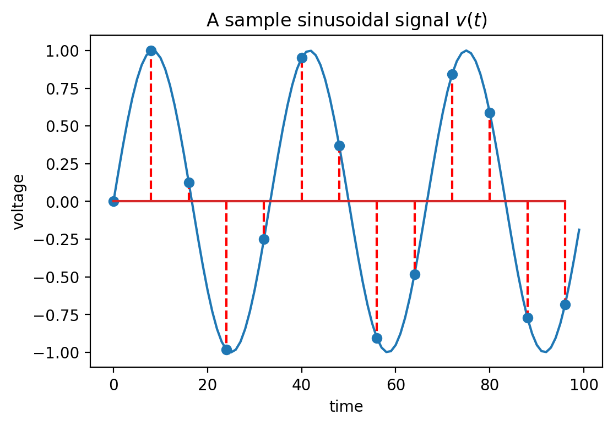
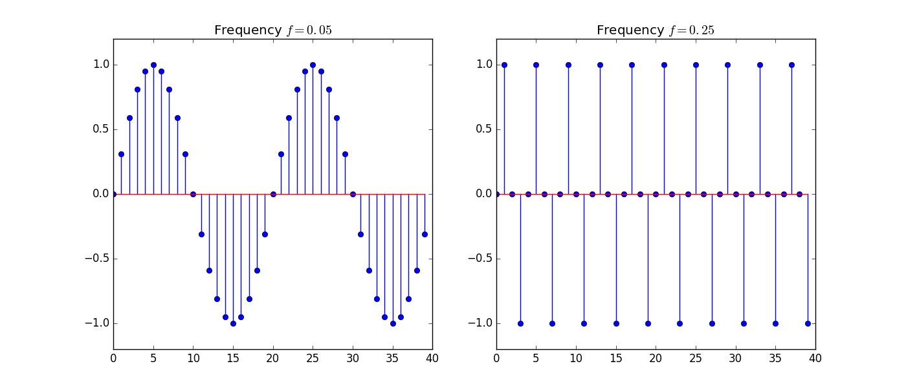
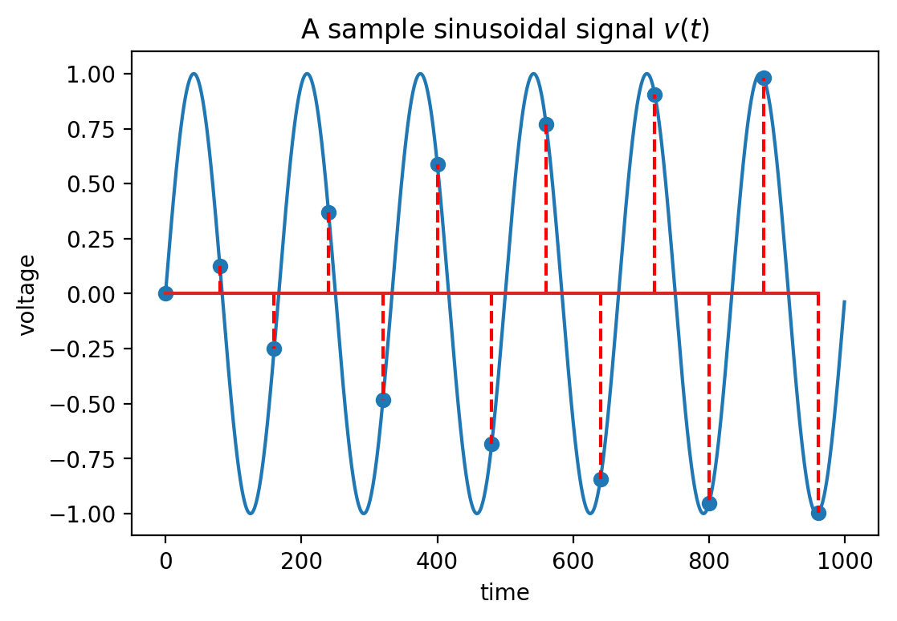
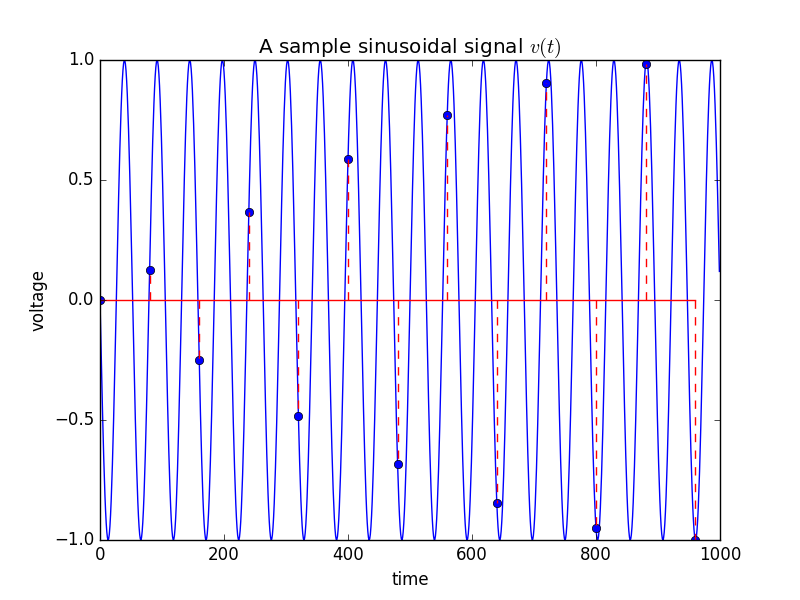

# I. Sampling of analog signals

## I.1. Analog and Digital Signals

### Signals

- Signal = a measurable quantity which varies in time, space or some other variable

* Examples:
    - a voltage which varies in time (1D voltage signal)
    - sound pressure which varies in time (sound signal)
    - intensity of light which varies across a photo (2D image)

- Represented as a mathematical function, e.g. $v(t)$.

### Off Topic

- Glossary:
    - "e.g." = "*exampli gratia*" (lat.) = "for example" (eng.) = "de exemplu" (rom.)
    - "i.e." = "*id est*" (lat) = "that is" (eng.) = "adică" (rom.)

### Signal dimension

- **Unidimensional** (1D) signal = a function of a single variable
    - Example: a voltage signal $v(t)$ only varies in time.

- **Multidimensional** (2D, 3D ... M-D) signal = a function of a multiple variables
    - Example: intensity of a grayscale image $I(x,y)$ across the surface of a photo

- In these lectures we consider only 1D signals, but the theory is similar

### Continuous and discrete signals

- Continuous (analog) signal = function of a continuous variable
    - Signal has a value for possible value of the variable in the defined range
    - The variable may be defined only in a certain range (e.g. $t \in [0,100]$),
    but it is a compact range

- Discrete signal = function of a discrete variable
    - Signal has values only at certain discrete values (*samples*)
    - Indexed with natural numbers: $x[-1]$, $x[0]$, $x[1]$ etc.
    - Outside the samples, the signal is **not defined**


```
/home/ncleju/.local/bin/pweave:10: UserWarning: In Matplotlib 3.3
individual lines on a stem plot will be added as a LineCollection
instead of individual lines. This significantly improves the
performance of a stem plot. To remove this warning and switch to the
new behaviour, set the "use_line_collection" keyword argument to True.
  sys.exit(weave())
```

{width=12cm}\


### Notation

- We use the following notation throughout these lectures

- Continuous signal
    - Has **round parantheses**, e.g. $x_a(t)$
    - Sometimes has the $a$ subscript
    - The variable is usually $t$ (time)
    - $x(2.3)$ = the value of the signal $a(t)$ at $t = 2.3$

- Discrete signal
    - Has **square brackets**, e.g. $x[n]$
    - The variables are denoted as $n$ or $k$ (suggest natural numbers)
    - $x[3]$ = the value of the signal $x[n]$ for $n = 3$
    - $x[1.5]$ = does not exist

### Signals with continuous and discrete values 

- The signal values can be continuous or discrete
    - Example: signal values stored as 8-bit or 16-bit values

- On digital systems, signals always have discrete values due to finite number precision

### Discrete frequency

- A signal is **periodic** if the values repeat themselves after a certain time (**period**)

- Frequency = inverse of period

- Pulsation $\omega$ = 2 * $\pi$ * frequency

- Continuous signals:
    - Periodic: $x_a(t) = x(t + T)$
    - $T$ is usually measured in seconds (or some other unit)
    - $F = \frac{1}{T}$ is measured in Hz = $\frac{1}{s}$ (Hertz)

- Discrete signals:
    - Periodic: $x[n] = x[n + N]$
    - $N$ **has no unit**, because it is just a number
    - $f = \frac{1}{N}$ **has no unit** also

### Domain of existence of frequency

- Continuous signals
    - Period $T$ can be as small as possible $T \to 0$
    - Therefore $F$ could go up to $\infty$

- Discrete signals
    - Smallest period is $N = 2$ (excluding $N=1$, constant signals)
    - Largest possible frequency is $f_{max} = \frac{1}{2}$
    - Consequence of using natural numbers to index the samples (x[0], x[1], x[2]...),
    without any physical unit attached

- For mathematical reasons: we will consider negative frequencies as well (remember SCS)
    - they mirror the positive frequencies.

## I.2. Sampling

### Sampling

- Taking the values from an analog signal at certain discrete moments of time, usually periodic

- Distance between two samples = **sampling period** $T_s$

- **Sampling frequency** $F_s = \frac{1}{T_s}$

- Why sampling?
    - Converts continuous signals to discrete
    - Processing of continuous signals is expensive
    - Processing of discrete signals is cheap (digital devices)
    - Sometimes nothing is lost due to sampling 

### Graphical example


```
/home/ncleju/.local/bin/pweave:8: UserWarning: In Matplotlib 3.3
individual lines on a stem plot will be added as a LineCollection
instead of individual lines. This significantly improves the
performance of a stem plot. To remove this warning and switch to the
new behaviour, set the "use_line_collection" keyword argument to True.
  if __name__ == '__main__':
```

\


### Sampling equation

- Sampling of the continuous signal $x_a$:
$$x[n] = x_a(n \cdot T_s)$$

- The $n$-th value of the discrete signal $x[n]$ is the value of the
analog signal $x_a(t)$ taken after $n$ sampling periods, at $t = n \cdot T_s$

### Sampling of harmonic signals

- Let's sample a cosine: $x_a(t) = cos (2 \pi F t)$

$$\begin{split}
x[n] =& x_a(n T_s) \\
=& cos(2 \pi F n T_s)\\
=& cos(2 \pi F n \frac{1}{F_s})\\
=& cos(2 \pi \underbrace{\frac{F}{F_s}}_{f} n)
\end{split}$$

- Sampling a continuous cosine (or sine) produces a discrete cosine (or sine)

- The discrete frequency is $f = \frac{F}{F_s}$

### Discrete frequency is relative

$$f = \frac{F}{F_s}$$

- Discrete frequency should be understood as **relative to the sampling frequency**
    - $f = \frac{1}{4}$ means "coming from an analog frequency F which was 
$\frac{1}{4}$ of the sampling frequency"
    - $f = 0.1$ means "one tenth of the sampling frequency", and so on


### False friends

- **Note:** A discrete sinusoidal signal might not _look_ sinosoidal, when its frequency is high (close to $\frac{1}{2}$).


```
/home/ncleju/.local/bin/pweave:7: UserWarning: In Matplotlib 3.3
individual lines on a stem plot will be added as a LineCollection
instead of individual lines. This significantly improves the
performance of a stem plot. To remove this warning and switch to the
new behaviour, set the "use_line_collection" keyword argument to True.

/home/ncleju/.local/bin/pweave:11: UserWarning: In Matplotlib 3.3
individual lines on a stem plot will be added as a LineCollection
instead of individual lines. This significantly improves the
performance of a stem plot. To remove this warning and switch to the
new behaviour, set the "use_line_collection" keyword argument to True.
```

{width=12cm}\


### Sampling theorem (Nyquist-Shannon)

- If a signal that has maximum frequency $F_{max}$ is sampled with a a sampling frequency 
$$F_s \ge 2 F_{max},$$
    then it can be perfectly reconstructed from its samples using the formula:
$$x_a(t) = \sum_{n=-\infty}^{+\infty} x[n] \cdot \frac{sin(\pi (F_s t - n))}{\pi (F_s t - n)}.$$


### Comments on the sampling theorem
- All the information in the original signal is contained in the samples, 
provided the sampling frequency is high enough
- We can process discrete samples instead of the original analog signals
- Sampling with $F_s \ge 2F_{max}$ makes the discrete frequency smaller than 1/2 $$f = \frac{F}{F_s} \leq \frac{F_{max}}{F_s} \leq \frac{1}{2}$$

### Aliasing

- http://www.dictionary.com/browse/alias:
    - “alias”: a false name used to conceal one’s identity; an assumed name

- What happens when the sampling frequency is not high enough?

- Every discrete frequency $f$ outside the interval $f \notin [-\frac{1}{2}, \frac{1}{2}]$
is **identical** (an "alias") with a frequency from this interval $f_{alias} \in [-\frac{1}{2}, \frac{1}{2}]$

- Proof: at blackboard 
    - Consider $x[n] = cos(2 \pi f n)$, $f \notin [-\frac{1}{2}, \frac{1}{2}]$
    - We can always add/subtract $2 \pi n$ since $cos()$ is periodical, with no change
    - This means increasing/reducing $f$ by 1
    - Thus we can always end up a frequency $f_{alias} \in [-1/2, 1/2]$ (up to a sign change)

### Aliasing

- Frequency **folding**: if $f$ exceeds the limit $\frac{1}{2}$ with $\epsilon$, it aliases 
a frequency below $\frac{1}{2}$ with $\epsilon$, symmetrically

$$cos (2 \pi (\frac{1}{2} + \epsilon)n) = cos (2 \pi (\frac{1}{2} - \epsilon)n)$$

$$sin (2 \pi (\frac{1}{2} + \epsilon)n) = - sin (2 \pi (\frac{1}{2} - \epsilon)n)$$

### Aliasing

Equivalently:

- If an analog frequency $F$ exceeds the limit $\frac{F_s}{2}$ with some $\epsilon$, 
it produces the same samples (alias) as another analog frequency smaller
than $\frac{F_s}{2}$ with $\epsilon$, symmetrically

- Example: $F = 1000 Hz$ sampled with $F_s = 1600 Hz$ aliases $F_{alias} = 600 Hz$.


### Aliasing

- Aliasing only affects digital signals, caused by sampling

- Sampling with $F_s \ge 2 F_{max}$ ensures $f \le \frac{1}{2}$, so no aliasing

### Aliasing example - low frequency signal


```
/home/ncleju/.local/bin/pweave:8: UserWarning: In Matplotlib 3.3
individual lines on a stem plot will be added as a LineCollection
instead of individual lines. This significantly improves the
performance of a stem plot. To remove this warning and switch to the
new behaviour, set the "use_line_collection" keyword argument to True.
  if __name__ == '__main__':
```

\


### Aliasing example - high frequency signal, same samples


```
/home/ncleju/.local/bin/pweave:8: UserWarning: In Matplotlib 3.3
individual lines on a stem plot will be added as a LineCollection
instead of individual lines. This significantly improves the
performance of a stem plot. To remove this warning and switch to the
new behaviour, set the "use_line_collection" keyword argument to True.
  if __name__ == '__main__':
```

\


### The problem of aliasing

- Sampling different signals leads to exactly same samples

- How to know from what signal did the samples come from? Impossible.

- Better remove from the signal the frequencies larger than $\frac{F_s}{2}$, 
otherwise they will create a false frequency and bring confusion

- Anti-alias filter: a low-pass filter situated before a sampling circuit, 
rejecting all frequencies $F > \frac{F_s}{2}$ from the signal before sampling
    - Standard practice in the design of processing systems
   
### Signal reconstruction from samples   
- A discrete frequency $f \in [-\frac{1}{2}, \frac{1}{2}]$ will be reconstructed as follows:
$$x_r(t) = x[\frac{t}{T_s}] = x[t \cdot F_s]$$

- For a discrete frequency outside the $[-\frac{1}{2}, \frac{1}{2}]$ interval
    - Reconstruction of the original frequency is impossible
    - The frequency is replaced with the aliased frequency $f'$ from the interval $[-\frac{1}{2}, \frac{1}{2}]$

- Reconstruction always produces signals with frequencies in $[-\frac{Fs}{2}, \frac{Fs}{2}]$
   
- Only signals sampled according to the sampling theorem will be reconstructed identically
    
### Signal quantization and coding   

- In practice, the values of the samples are rounded to fixed levels, e.g. 8-bit, 16-bit values.

- This "rounding" is known as **quantization**

- The "rounding error" is known as **quantization error** 

- Converting the value in binary form is known as **coding**

### A/D and D/A conversion

- Sampling + quantization + coding is usually done by an **Analog to Digital Converter (ADC)** 
    - It takes an analog signal and produces a sequence of binary-coded values
   
- Reconstructing an analog signal from numeric samples is done by a **Digital to Analog Converter (DAC)**
    - Usually reconstruction is not based on sampling theorem equation, which is too complex, but with simpler empiric approaches.
