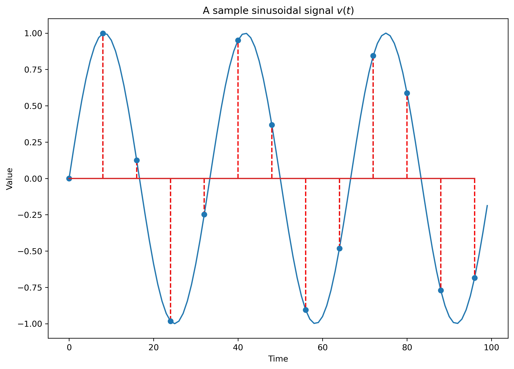
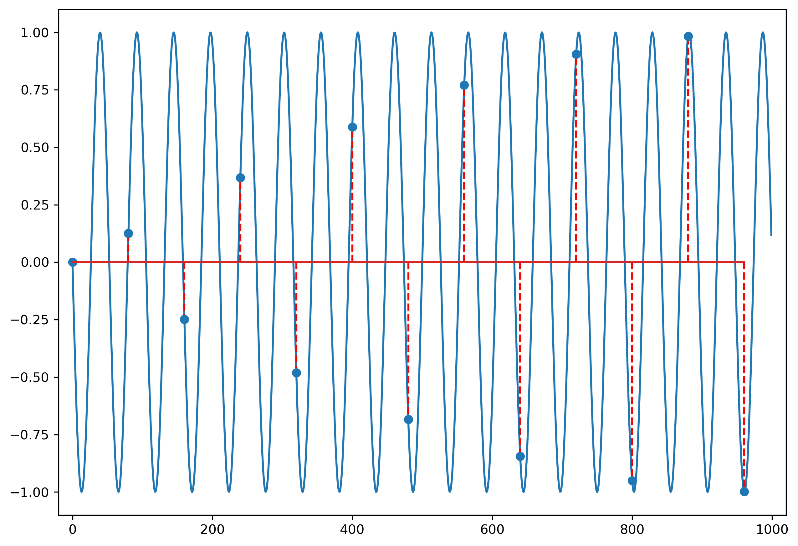
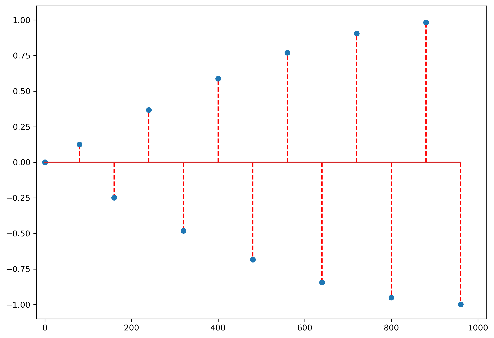

# I. Sampling of analog signals

## I.1. Analog and Digital Signals

### Signals

- Signal = a measurable quantity which varies in time, space or some other variable

* Examples:
    - a voltage which varies in time (1D voltage signal)
    - sound pressure which varies in time (sound signal)
    - intensity of light which varies across a photo (2D image)

- Represented as a mathematical function, e.g. $v(t)$.

### Glossary

- Glossary:
    - "e.g." = "*exampli gratia*" (lat.) = "for example" (eng.) = "de exemplu" (rom.)
    - "i.e." = "*id est*" (lat) = "that is" (eng.) = "adică" (rom.)

### Signal dimension

- **Unidimensional** (1D) signal = a function of a single variable
    - Example: a voltage signal $v(t)$ only varies in time.

- **Multidimensional** (2D, 3D ... M-D) signal = a function of a multiple variables
    - Example: intensity of a grayscale image $I(x,y)$ across the surface of a photo

- In these lectures we consider only 1D signals, but the theory is similar

### Continuous and discrete signals

- Continuous (analog) signal = function of a continuous variable
    - Signal has a value for possible value of the variable in the defined range
    - The variable may be defined only in a certain range (e.g. $t \in [0,100]$),
    but it is a compact range

- Discrete signal = function of a discrete variable
    - Signal has values only at certain discrete values (*samples*)
    - Indexed with natural numbers: $x[-1]$, $x[0]$, $x[1]$ etc.
    - Outside the samples, the signal is **not defined**

```{.python .cb.run session=plot}
import matplotlib.pyplot as plt, numpy as np, math
tanalog = np.arange(0,100)                 # this means 0,1,2,...100
vanalog = np.sin(2*math.pi*0.03*tanalog)   # sin(2*pi*f*t)
tdiscrete = np.arange(-2, 9)
vdiscrete = np.array([0, 1, 2, 2, 1, 0, -1, -2, -2, -1, 0]) 
plt.figure(figsize=(10, 3));
plt.subplot(121)
plt.plot(tanalog,vanalog); plt.title('Analog signal $a(t)$')
plt.subplot(122)
plt.stem(tdiscrete,vdiscrete, use_line_collection=True); plt.title ('Discrete signal $b[n]$');
plt.savefig('fig/01_Sampling_AnalogVsDiscrete.png', transparent=True, bbox_inches='tight', dpi=300)
plt.close()
```
{width=100% max-width=1000px}

### Notation

- We use the following notation:

- Continuous signal
    - Has **round parantheses**, e.g. $x_a(t)$
    - Sometimes has the $a$ subscript
    - The variable is usually $t$ (time)
    - $x(2.3)$ = the value of the signal $a(t)$ at $t = 2.3$

- Discrete signal
    - Has **square brackets**, e.g. $x[n]$
    - The variables are denoted as $n$ or $k$ (suggest natural numbers)
    - $x[3]$ = the value of the signal $x[n]$ for $n = 3$
    - $x[1.5]$ = does not exist

### Signals with continuous and discrete values 

- Not only the time can be continuous or discrete

- The signal **values** can also be continuous or discrete
    - Example: signal values stored as 8-bit or 16-bit values

- On digital systems, signals always have discrete values due to finite number precision

### Discrete frequency

- A signal is **periodic** if the values repeat themselves after a certain time (**period**)

- Frequency = inverse of period

- Pulsation $\omega$ = 2 * $\pi$ * frequency

- Continuous signals:
    - Periodic: $x_a(t) = x(t + T)$
    - $T$ is usually measured in seconds (or some other unit)
    - $F = \frac{1}{T}$ is measured in Hz = $\frac{1}{s}$ (Hertz)

- Discrete signals:
    - Periodic: $x[n] = x[n + N]$
    - $N$ **has no unit**, because it is just a number
    - $f = \frac{1}{N}$ **has no unit** also

### Frequency limits

- For continuous signals, $F$ can go to $\infty$
    - Because period $T$ can be $T \to 0$

\smallskip

- For discrete signals, **largest frequency** is $f_{max} = \frac{1}{2}$
    - Smallest period is $N = 2$ (excluding $N=1$, constant signals)
    - Consequence of using natural numbers to index the samples (x[0], x[1], x[2]...),
    without any physical unit attached

\smallskip

- For mathematical reasons, we will consider negative frequencies as well (remember SCS)
  (e.g. $-\omega$)

### Domain of definition

- **Finite-length** discrete signals $x[n]$:
  - have only a certain number $N$ of samples (e.g. for $n = 0, 1, ... N-1)
  - they are not defined outside these samples
  - can be represented as a **vector** of numbers (e.g. like in Matlab, C)

\smallskip

- **Infinite-length** discrete signals $x[n]$:
   - e.g. defined for $n = ... -2, -1, 0, 1, 2, ...$ or 

### Vector space of signals

- All signals of a certain length $N$ form a **vector space**

- In mathematics, a vector space = a set $V$ of elements $\{v\}$ (called ``vectors'') such that:
    - the sum of any two elements from $V$ is still a member of $V$
    - any vector from $V$ multiplied by a constant is still a member of $V$
    
- These properties can easily be verified for signals

## I.2. Sampling

### Sampling

- Sampling = Taking the values from an analog signal at certain discrete moments of time, usually periodic

- Distance between two samples = **sampling period** $T_s$

- **Sampling frequency** $F_s = \frac{1}{T_s}$

- Why sampling?
    - Converts continuous signals to discrete
    - Processing of continuous signals is expensive
    - Processing of discrete signals is cheap (digital devices)
    - Sometimes nothing is lost due to sampling 

### Graphical example

```{.python .cb.run session=plot}
import matplotlib.pyplot as plt, numpy as np, math
t = np.arange(0,100)                 # 
xa = np.sin(2*math.pi*0.03*t)        # analog signal
Ts = 8                               # Sampling period Ts=10, sampling freq Fs = 0.1
td = t[0:101:Ts]                     # go from 0 to 100 with step=Ts, i.e. 0,10,20,...
xd = xa[td]
plt.plot(t,xa)                       # plotting
plt.stem(td,xd,'--r', use_line_collection=True)
plt.xlabel('Time')
plt.ylabel('Value')
plt.title('A sample sinusoidal signal $v(t)$')
plt.savefig('fig/01_Sampling_SampleSinus.png', transparent=True, bbox_inches='tight', dpi=300)
plt.close()
```
{width=100% max-width=1000px}


### Sampling equation

- Mathematically, it is described by **the sampling equation**:

$$x[n] = x_a(n \cdot T_s)$$

- Produces a discrete signal $x[n]$ from a continuous signal $x_a(t)$

- The $n$-th value of the discrete signal $x[n]$ is the value of the
analog signal $x_a(t)$ taken after $n$ sampling periods, at time $n \cdot T_s$

### Sampling of harmonic signals

- Let's sample a cosine: $x_a(t) = cos (2 \pi F t)$

$$\begin{split}
x[n] =& x_a(n T_s) \\
=& cos(2 \pi F n T_s)\\
=& cos(2 \pi F n \frac{1}{F_s})\\
=& cos(2 \pi \underbrace{\frac{F}{F_s}}_{f} n)
\end{split}$$

- Sampling a continuous (cosine produces a discrete cosine
  with **discrete frequency**:
$$f = \frac{F}{F_s}$$

- Same for sine instead of cosine


### Discrete frequency is relative

$$f = \frac{F}{F_s}$$

- Discrete frequency should be understood as a value **relative to the sampling frequency**
 
- Example: $f = \frac{1}{4}$ means 
"coming from an analog frequency F which was $\frac{1}{4}$ of the sampling frequency"
    - it could have been a 100Hz signal sampled with 400Hz
    - it could also have been a 3MHz signal sampled with 12MHz


### False friends

- **Note:** A discrete sinusoidal signal might not _look_ sinusoidal, when its frequency is high (close to $\frac{1}{2}$).

```{.python .cb.run session=plot}
import matplotlib.pyplot as plt, numpy as np, math
t = np.arange(0,40)                  #
x1 = np.sin(2*math.pi*0.05*t)         #  frequency 
x2 = np.sin(2*math.pi*0.25*t)          # sin(2*pi*f*t)
plt.figure(figsize=(10, 3));
plt.subplot(121)
plt.stem(t,x1); plt.title('Frequency $f = 0.05$')
plt.axis([0, 40, -1.2, 1.2])
plt.subplot(122)
plt.axis([0, 40, -1.2, 1.2])
plt.stem(t,x2); plt.title ('Frequency $f = 0.25$')
plt.savefig('fig/01_Sampling_FalseFriends.png', transparent=True, bbox_inches='tight', dpi=300)
plt.close()
```
{width=100% max-width=1000px}


### Sampling theorem (Nyquist-Shannon)

The Nyquist-Shannon sampling theorem:

- If a signal $x_a(t)$ that has maximum frequency $F_{max}$ is sampled with a a sampling frequency 
$$F_s \ge 2 F_{max},$$
    then it can be perfectly reconstructed from its samples using the formula:
$$x_a(t) = \sum_{n=-\infty}^{+\infty} x[n] \cdot \frac{sin(\pi (F_s t - n))}{\pi (F_s t - n)}.$$


### Comments on the sampling theorem

- All the information in the original signal is contained in the samples, 
provided the sampling frequency is high enough

\smallskip

- It is much easier to process discrete samples instead of nalog signals
(e.g. using Matlab instead of capacitors :) )

\smallskip

- Sampling with $F_s \ge 2F_{max}$ makes the discrete frequency smaller than 1/2 $$f = \frac{F}{F_s} \leq \frac{F_{max}}{F_s} \leq \frac{1}{2}$$


### Example of the sampling theorem in action

Sampling theorem in action:

- Humans can only hear sounds up to ~20kHz

- Use sampling rates higher than 40kHz => no quality loss 

  - Standardized for CD-Audio: 44100Hz

### Aliasing

- http://www.dictionary.com/browse/alias:
    - “alias”: a false name used to conceal one’s identity; an assumed name

- What happens when the sampling frequency is not high enough?

- Example: $F = 600Hz$ sampled with $F_s = 1000Hz$

$$\begin{split}
x[n] =& x_a(n T_s) \\
=& cos(2 \pi 600 n T_s)\\
=& cos(2 \pi 600 n \frac{1}{1000})\\
=& cos(2 \pi \underbrace{\frac{6}{10}}_{f} n)
\end{split}$$

- Bad sign: We get a frequency larger than $f_{max} = \frac{1}{2}$

### Funny things with cos() and sin()

- Discrete cos() and sin() have funny properties

- They are **the same** when adding an integer to the frequency:
$$\cos(2 \pi (f+k) n) = \cos(2 \pi f n + (2 k n \pi) = \cos(2 \pi f n) $$

- So all these discrete frequencies are identical:
$$ f = ... = -1.4 = -0.4 = 0.6 = 1.6 = 2.6 = 3.6 = ... $$

- In addition, negative frequencies can be turned into positive:
$$\cos(2 \pi (-f) n) = \cos(2 \pi f n) $$
$$\sin(2 \pi (-f) n) = -\sin(2 \pi f n) $$

### Aliasing

**Aliasing:**

- Every discrete frequency $f$ outside the interval $[-\frac{1}{2}, \frac{1}{2}]$
is **identical** (an "alias") with a frequency from this interval $f_{alias} \in [-\frac{1}{2}, \frac{1}{2}]$

- Just add or subtract 1's to $f$ until the result is in $[-\frac{1}{2}, \frac{1}{2}]$

### Aliasing example - low frequency signal

```{.python .cb.run session=plot}
import matplotlib.pyplot as plt, numpy as np, math
t = np.arange(0,1000)                 # 
Ts = 80                               # Sampling period Ts=10, sampling freq Fs = 0.1
xa = np.sin(2*math.pi*0.006*t)        # analog signal
td = t[0:1001:Ts]                     # go from 0 to 100 with step=Ts, i.e. 0,10,20,...
xd = xa[td]
plt.plot(t,xa)                       # plotting
plt.stem(td,xd,'--r', use_line_collection=True)
plt.xlim(-20, 1020)
plt.ylim(-1.1, 1.1)
plt.savefig('fig/01_Sampling_AliasingLowFreq.png', transparent=True, bbox_inches='tight', dpi=300)
plt.close()
```
{width=100% max-width=1000px}


### Aliasing example - high frequency signal, same samples

```{.python .cb.run session=plot}
import matplotlib.pyplot as plt, numpy as np, math
t = np.arange(0,1000)                 # 
Ts = 80                               # Sampling period Ts=10, sampling freq Fs = 0.1
xa = -np.sin(2*math.pi*(2/Ts -0.006)*t)        # analog signal
td = t[0:1001:Ts]                     # go from 0 to 100 with step=Ts, i.e. 0,10,20,...
xd = xa[td]
plt.plot(t,xa)                       # plotting
plt.stem(td,xd,'--r', use_line_collection=True)
plt.xlim(-20, 1020)
plt.ylim(-1.1, 1.1)
plt.savefig('fig/01_Sampling_AliasingHighFreq.png', transparent=True, bbox_inches='tight', dpi=300)
plt.close()
```
{width=100% max-width=1000px}

### Aliasing example - samples only

```{.python .cb.run session=plot}
import matplotlib.pyplot as plt, numpy as np, math
t = np.arange(0,1000)                 # 
Ts = 80                               # Sampling period Ts=10, sampling freq Fs = 0.1
xa = -np.sin(2*math.pi*(2/Ts -0.006)*t)        # analog signal
td = t[0:1001:Ts]                     # go from 0 to 100 with step=Ts, i.e. 0,10,20,...
xd = xa[td]
###plt.plot(t,xa)                       # plotting
plt.stem(td,xd,'--r', use_line_collection=True)
plt.xlim(-20, 1020)
plt.ylim(-1.1, 1.1)
plt.savefig('fig/01_Sampling_AliasingOnlySamples.png', transparent=True, bbox_inches='tight', dpi=300)
plt.close()
```
{width=100% max-width=1000px}


### The problem of aliasing

- Sampling different signals can lead to exactly same samples

- Problem: how to know from what signal did the samples come from? Impossible.

- Example:
  - all these discrete frequencies are identical:
    $$ f = -0.4 = 0.4 = 0.6 = 1.6 = ...$$

  - so if $F_s = 1000Hz$, the original signal could have been any frequency $F$ out of: 400Hz or 600Hz or 1400Hz or 1600Hz or ...
    
  - Exercise: check some of these


### Anti-alias

- Aliasing only affects digital signals (it is caused by sampling)

- Sampling according to Shannon theorem guarantees no aliasing:

    $$F_s \ge 2 F_{max} \Rightarrow f = \frac{F}{F_{max}} \le \frac{1}{2}$$

- Better remove from the signal the frequencies larger than $\frac{F_s}{2}$, 
which will not be sampled correctly,
otherwise they will create a false frequency and bring confusion

### Anti-alias

- **Anti-alias filter**: a low-pass filter situated before a sampling circuit, 
rejecting all frequencies $F > \frac{F_s}{2}$ from the signal before sampling

    - Standard practice in the design of processing systems
   
### Ideal signal reconstruction from samples   

- Reconstruction = opposite of sampling

- Produces a continuous signal from a discrete one

**Ideal reconstruction equation:**
$$x_r(t) = x[\frac{t}{T_s}] = x[t \cdot F_s]$$

- A discrete frequency $f$ becomes $F = f \cdot F_s$

### Reconstruction and aliasing

- What value to use for $f$?
   - we know $f = f + 1 = f+2 = ...$, which one to use?

- The reconstruction assumes all $f$ are in the interval $[-\frac{1}{2}, \frac{1}{2}]$
   - apply reconstruction equation
   - the resulting signal has all frequencies $F \leq \frac{F_s}{2} = F_N$ ( = "the Nyquist frequency")

- **In exercises:** Always bring $f$ in the interval $[-\frac{1}{2}, \frac{1}{2}]$ before reconstruction
    
- Reconstruction always produces signals with frequencies in $[-\frac{Fs}{2}, \frac{Fs}{2}]$
   - Only signals or components sampled according to the sampling theorem will be reconstructed identically
   - Any other components are replaced with their aliased counterparts

### A/D and D/A conversion

- Sampling + quantization + coding is usually done by an **Analog to Digital Converter (ADC)** 
    - It takes an analog signal and produces a sequence of binary-coded values
   
\smallskip
   
- Reconstructing an analog signal from numeric samples is done by a **Digital to Analog Converter (DAC)**
    - Usually the reconstruction is not based on sampling theorem equation, which is too complicated, but with simpler empirical solutions  

\smallskip

- You have ADCs and DACs for any In or Out audio jack (phone, computer etc)
    
### Signal quantization and coding   

- In practice, the amplitudes of the samples are converted to binary representation

- Because of this, the amplitudes are rounded to fixed levels, e.g. 8-bit values (256 distinct levels) , 16-bit values (65536).

- This "rounding" is known as **quantization**

- The "rounding error" is known as **quantization error** 

- Converting the value to binary form is known as **coding**

- ADCs handle sampling, quantization and coding simultaneously