## I.1. Analog and Digital Signals

### Signals

- Signal = a measurable quantity which varies in time, space or some other variable

- Examples:
  - a voltage which varies in time (1D voltage signal)
  - sound pressure which varies in time (sound signal)
  - intensity of light which varies across a photo (2D image)

- Represented as a mathematical function, e.g. $v(t)$.

### Glossary

- Glossary:
  - "e.g." = "*exempli gratia*" (lat.) = "for example" (eng.) = "de exemplu" (rom.)
  - "i.e." = "*id est*" (lat) = "that is" (eng.) = "adică" (rom.)

### Signal dimension

- **Unidimensional** (1D) signal = a function of a single variable
  - Example: a voltage signal $v(t)$ only varies in time.

- **Multidimensional** (2D, 3D ... M-D) signal = a function of multiple variables
  - Example: intensity of a grayscale image $I(x,y)$ across the surface of a photo

- In these lectures we consider only 1D signals, but the theory is similar

### Continuous and discrete signals

- Continuous (analog) signal = function of a continuous variable
  - Signal has a value for every possible value of the variable in the defined range
  - The variable may be defined only in a certain range (e.g. $t \in [0,100]$),
    but it is a continuous range

- Discrete signal = function of a discrete variable
  - Signal has values only at certain discrete values (*samples*)
  - Indexed with integer numbers: $x[-1]$, $x[0]$, $x[1]$ etc.
  - Outside the samples, the signal is **not defined**

```{python .cb.run session=plot}
import matplotlib.pyplot as plt, numpy as np, math
tanalog = np.arange(0,100)                 # this means 0,1,2,...100
vanalog = np.sin(2*math.pi*0.03*tanalog)   # sin(2*pi*f*t)
tdiscrete = np.arange(-2, 9)
vdiscrete = np.array([0, 1, 2, 2, 1, 0, -1, -2, -2, -1, 0])
plt.figure(figsize=(10, 3));
plt.subplot(121)
plt.plot(tanalog,vanalog); plt.title('Analog signal $x_a(t)$')
plt.subplot(122)
plt.stem(tdiscrete,vdiscrete, use_line_collection=True); plt.title ('Discrete signal $b[n]$');
plt.savefig('fig/01_Sampling_AnalogVsDiscrete.png', transparent=True, bbox_inches='tight', dpi=300)
plt.close()
```
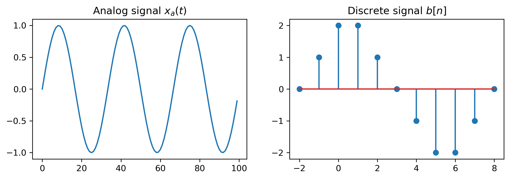{width=100% max-width=1000px}

### Notation

- We use the following notation:

- Continuous signal
    - Has **round parentheses**, e.g. $x_a(t)$
    - Sometimes has the $a$ subscript
    - The variable is usually $t$ (time)
    - $x_a(2.3)$ = the value of the signal $x_a(t)$ at $t = 2.3$

- Discrete signal
    - Has **square brackets**, e.g. $x[n]$
    - The variables are denoted as $n$ or $k$ (suggest natural numbers)
    - $x[3]$ = the value of the signal $x[n]$ for $n = 3$
    - $x[1.5]$ = does not exist

### Continuous, sampled and digital signals

- **Analog signal**: continuous time, continuous amplitude
  - e.g. a microphone voltage $x_a(t)$

- **Sampled signal**: discrete time, continuous amplitude
  - sampling selects the values $x_a(nT_s)$

- **Digital signal**: discrete time, discrete amplitude
  - quantization rounds every sample to one of a finite number of levels

- **Sampling discretizes time; quantization discretizes amplitude**

### Periodic signals

- A signal is **periodic** if the values repeat themselves after a certain time (**fundamental period**)

- Continuous signals:
    - Periodic: $x_a(t) = x_a(t + T), \forall t, \textrm{ where } T > 0$
    - $T$ is usually measured in seconds (or some other unit)

- Discrete signals:
    - Periodic: $x[n] = x[n + N], \forall n, \textrm{ where } N > 0$
    - $N$ **has no unit**, because it is just a number

### Discrete frequency

- Harmonic signals have a frequency $f$:
  $$x(t) = 2 \cdot \cos(2 \pi \cdot 400 \cdot t + \frac{\pi}{3})$$
  $$x[n] = 5 \cdot \sin(2 \pi \cdot  0.12 \cdot n + \frac{\pi}{2})$$

- Pulsation $\omega$ = 2 $\pi \cdot$  frequency

- Continuous signals:
    - $T = \frac{1}{f}$ is usually measured in seconds (or some other unit)
    - $F = \frac{1}{T}$ is measured in Hz = $\frac{1}{s}$ (Hertz)

- Discrete signals:
    - $N$ **has no unit**, because it is just a number
    - $f$ **has no unit** also

### Periodicity of a discrete sinusoid

- Consider $$x[n] = \cos(2 \pi f n)$$

- It is periodic **if and only if** $f$ is rational

- If $f = \frac{p}{q}$ is in lowest terms, its fundamental period is
  $$N=q$$

- Example: $f=\frac{3}{8}$ gives $N=8$

- Contrast: $f=\frac{\sqrt{2}}{10}$ is irrational, so no finite period exists

### Period and frequency

```{python .cb.run session=plot}
import matplotlib.pyplot as plt, numpy as np, math
Tmax = 10
ta = np.arange(0, Tmax, 0.01)        #
td = np.arange(0, Tmax, 1)           #
xa = np.sin(2*math.pi*0.4*ta)        # analog signal
xd = np.sin(2*math.pi*0.4*td)        # discrete signal

plt.plot(ta,xa,'--r')                # plotting
plt.stem(td,xd, use_line_collection=True)
plt.xlabel('Time')
plt.ylabel('Value')
plt.title('Discrete signal and continuous signal')
plt.savefig('fig/01_DiscreteFreqPeriod.png', transparent=True, bbox_inches='tight', dpi=300)
plt.close()
```
<!-- 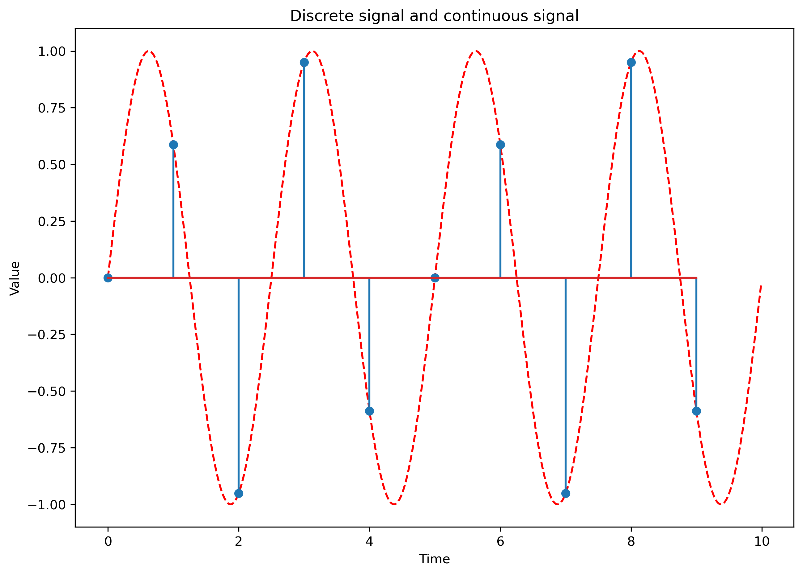{width=100% max-width=1000px} -->
{max-width=1000px, height=80%}

- Discrete signal period $N = 5$, frequency $f = 0.4$

### Period and frequency

- Quasi-periodic signals: $$x[n] = \sin(0.8 \cdot n)$$
- Frequency = irrational number, period = does not exist, but the signal is "almost periodic"

```{python .cb.run session=plot}
import matplotlib.pyplot as plt, numpy as np, math
Tmax = 30
ta = np.arange(0, Tmax, 0.01)        #
td = np.arange(0, Tmax, 1)           #
xa = np.sin(2*0.4*ta)        # analog signal
xd = np.sin(2*0.4*td)        # discrete signal

plt.plot(ta,xa,'--r')                # plotting
plt.stem(td,xd, use_line_collection=True)
plt.xlabel('Time')
plt.ylabel('Value')
plt.title('Quasi-periodical signal')
plt.savefig('fig/01_QuasiPeriodical.png', transparent=True, bbox_inches='tight', dpi=300)
plt.close()
```
<!-- {width=100% max-width=1000px} -->
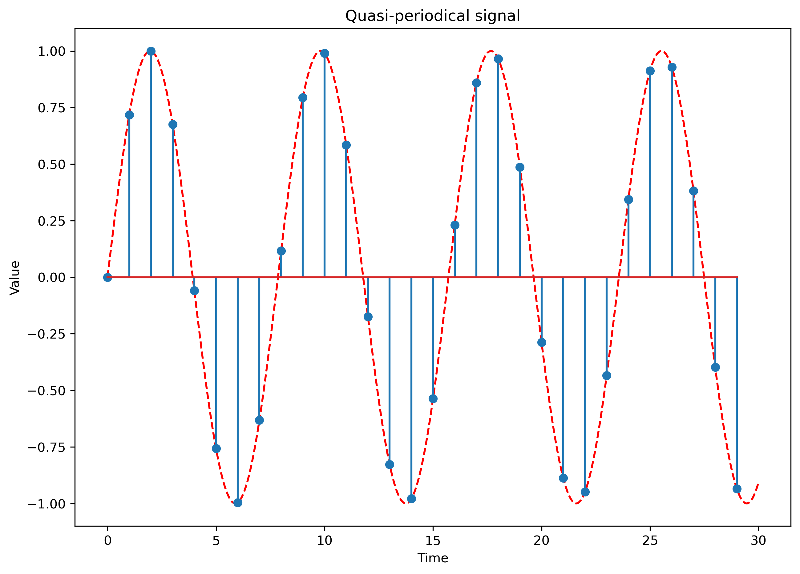{max-width=1000px, height=70%}

### Checkpoint: periodicity

- For $x[n]=\cos(2\pi f n)$, decide whether it is periodic:
  - $f=\frac{5}{12}$
  - $f=\frac{\sqrt{3}}{8}$

\smallskip

- **Answer:** the first signal is periodic with $N=12$; the second is not periodic
- Reducing $f=\frac{p}{q}$ to lowest terms is essential

### Domain of definition

- **Finite-length** discrete signals $x[n]$:
  - have only a certain number $N$ of samples (e.g. for $n$ = 0, 1, ... N-1)
  - they are not defined outside these samples
  - can be represented as a **vector** of numbers (e.g. like in Matlab, C)

\smallskip

- **Infinite-length** discrete signals $x[n]$:
   - e.g. defined for $n = ... -2, -1, 0, 1, 2, ...$

### Vector space of signals

- All signals of a certain length $N$ form a **vector space**

- In mathematics, a vector space = a set $V$ of elements $\{v\}$ (called ``vectors'') such that:
    - the sum of any two elements from $V$ is still a member of $V$
    - any vector from $V$ multiplied by a constant is still a member of $V$

- These properties can easily be verified for signals

## I.2. Sampling

### Sampling

- Sampling = Taking the values from an analog signal at certain discrete moments of time, usually periodic

- Distance between two samples = **sampling period** $T_s$

- **Sampling frequency** $F_s = \frac{1}{T_s}$

- Why sampling?
    - Converts continuous signals to discrete
    - Processing of continuous signals is expensive
    - Processing of discrete signals is cheap (digital devices)
    - Sometimes nothing is lost due to sampling

### From the physical world to digital processing

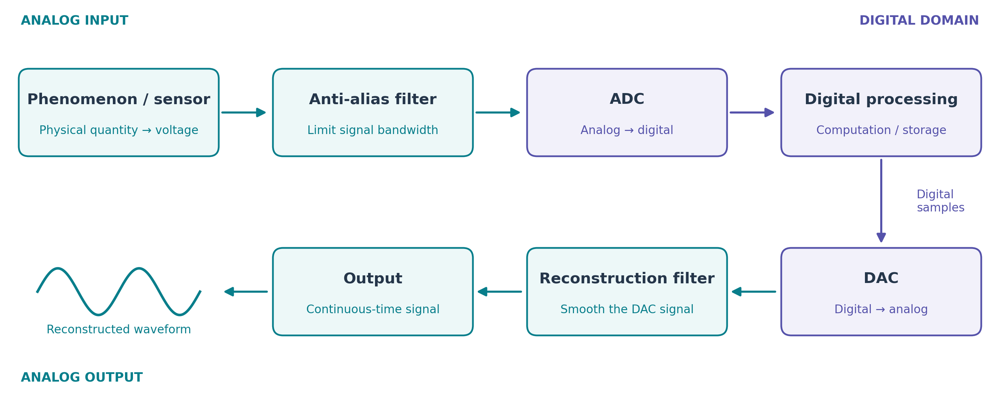{width=100% fig-alt="Signal chain from sensor through anti-alias filter, ADC, digital processing, DAC, and reconstruction filter to output."}

- ADC: **sampling $\rightarrow$ quantization $\rightarrow$ coding**
- Filters act in continuous time, before the ADC and after the DAC

### Graphical example

```{python .cb.run session=plot}
import matplotlib.pyplot as plt, numpy as np, math
t = np.arange(0,100)                 #
xa = np.sin(2*math.pi*0.03*t)        # analog signal
Ts = 8                               # Sampling period Ts=10, sampling freq Fs = 0.1
td = t[0:101:Ts]                     # go from 0 to 100 with step=Ts, i.e. 0,10,20,...
xd = xa[td]
plt.plot(t,xa)                       # plotting
plt.stem(td,xd,'--r', use_line_collection=True)
plt.xlabel('Time')
plt.ylabel('Value')
plt.title('A sample sinusoidal signal $v(t)$')
plt.savefig('fig/01_Sampling_SampleSinus.png', transparent=True, bbox_inches='tight', dpi=300)
plt.close()
```
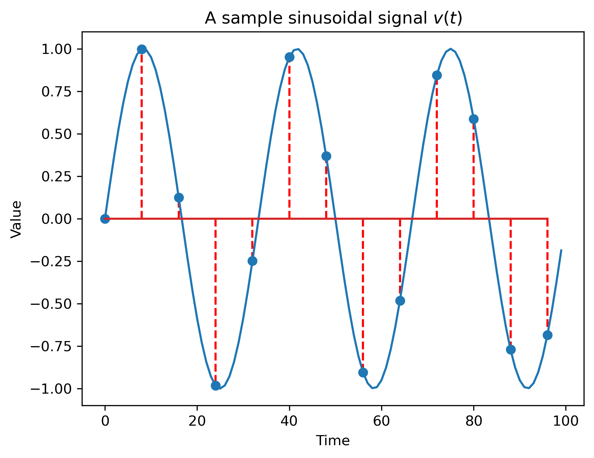{width=100% max-width=1000px}


### Sampling equation

- Mathematically, it is described by **the sampling equation**, which uses the Dirac delta function $\delta(t)$:

  $$x[n] = \int_{-\infty}^{+\infty} x_a(t) \delta(t - n T_s) dt$$

- For continuous signals, this is equal to the value of the signal at $t = n T_s$:

  $$x[n] = x_a(n \cdot T_s)$$

- Periodic sampling produces a discrete signal $x[n]$ from a continuous signal $x_a(t)$

### Sampling of harmonic signals

- Let's sample a cosine: $x_a(t) = \cos (2 \pi F t)$

$$\begin{split}
x[n] =& x_a(n T_s) \\
=& \cos(2 \pi F n T_s)\\
=& \cos(2 \pi F n \frac{1}{F_s})\\
=& \cos(2 \pi \underbrace{\frac{F}{F_s}}_{f} n)\\
=& \cos(2 \pi f n)
\end{split}$$

- Same for sine instead of cosine

### Discrete frequency is relative

- Sampling a continuous cosine produces a discrete cosine
  with **discrete frequency**:
$$f = \frac{F}{F_s}$$

- Discrete frequency should be understood as a value **relative to the sampling frequency**

- Example: $f = \frac{1}{4}$ means
"coming from an analog frequency F which was $\frac{1}{4}$ of the sampling frequency"
    - it could have been a 100Hz signal sampled with 400Hz
    - it could also have been a 3MHz signal sampled with 12MHz


### False friends

- **Note:** A discrete sinusoidal signal might not _look_ sinusoidal, when its frequency is high (close to $\frac{1}{2}$).

```{python .cb.run session=plot}
import matplotlib.pyplot as plt, numpy as np, math
t = np.arange(0,40)                  #
x1 = np.sin(2*math.pi*0.05*t)         #  frequency
x2 = np.sin(2*math.pi*0.25*t)          # sin(2*pi*f*t)
plt.figure(figsize=(10, 3));
plt.subplot(121)
plt.stem(t,x1); plt.title('Frequency $f = 0.05$')
plt.axis([0, 40, -1.2, 1.2])
plt.subplot(122)
plt.axis([0, 40, -1.2, 1.2])
plt.stem(t,x2); plt.title ('Frequency $f = 0.25$')
plt.savefig('fig/01_Sampling_FalseFriends.png', transparent=True, bbox_inches='tight', dpi=300)
plt.close()
```
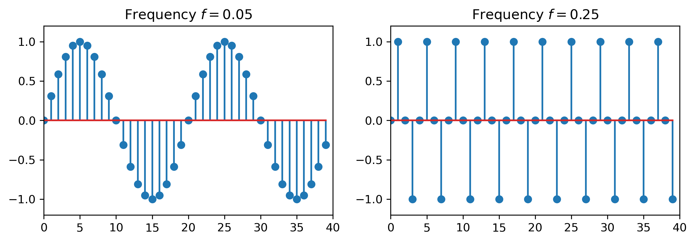{width=100% max-width=1000px}


### Sampling theorem (Nyquist-Shannon)

The Nyquist-Shannon sampling theorem:

- If a signal $x_a(t)$, which is band-limited with maximum frequency $F_{max}$, is sampled with a sampling frequency
$$F_s > 2 F_{max},$$
    then it can be perfectly reconstructed from its samples using the formula:
$$x_a(t) = \sum_{n=-\infty}^{+\infty} x[n] \cdot \frac{\sin(\pi (F_s t - n))}{\pi (F_s t - n)}.$$


### Comments on the sampling theorem

- All the information in the original signal is contained in the samples,
provided the sampling frequency is high enough

\smallskip

- It is much easier to process discrete samples instead of analog signals
(e.g. using Matlab instead of capacitors :) )

\smallskip

- Sampling with $F_s > 2F_{max}$ makes every signal frequency strictly smaller than 1/2:
  $$f = \frac{F}{F_s} \leq \frac{F_{max}}{F_s} < \frac{1}{2}$$

<!--
### Why the Nyquist inequality is strict

- At the boundary $F_s=2F_{max}$, take
  $$x_a(t)=\sin(2\pi F_{max}t)$$

- The samples are
  $$x[n]=x_a\left(\frac{n}{F_s}\right)
  =\sin\left(2\pi F_{max}\frac{n}{2F_{max}}\right)
  =\sin(\pi n)=0$$

- These samples are identical to the samples of the zero signal
- Therefore equality cannot guarantee recovery for arbitrary phases/signals
- The safe statement is **$F_s>2F_{max}$** -->


### Example of the sampling theorem in action

Sampling theorem in action:

- Humans can only hear sounds up to ~20kHz

- Sampling rates higher than 40kHz are enough for audible frequencies

  - Standardized for CD-Audio: 44100Hz

### Aliasing

- http://www.dictionary.com/browse/alias:
    - “alias”: a false name used to conceal one’s identity; an assumed name

- What happens when the sampling frequency is not high enough?

- Example: $F = 600Hz$ sampled with $F_s = 1000Hz$

$$\begin{split}
x[n] =& x_a(n T_s) \\
=& \cos(2 \pi 600 n T_s)\\
=& \cos(2 \pi 600 n \frac{1}{1000})\\
=& \cos(2 \pi \underbrace{\frac{6}{10}}_{f} n)
\end{split}$$

- Bad sign: We get a frequency larger than $f_{max} = \frac{1}{2}$

### Funny things with cos() and sin()

- Discrete cos() and sin() have funny properties

- They are **the same** when adding an integer to the frequency:
$$\cos(2 \pi (f+k) n) = \cos(2 \pi f n + 2 \pi k n ) = \cos(2 \pi f n) $$

- So all these discrete frequencies are identical:
$$ f = ... = -1.4 = -0.4 = 0.6 = 1.6 = 2.6 = 3.6 = ... $$

- In addition, negative frequencies can be turned into positive:
$$\cos(2 \pi (-f) n) = \cos(2 \pi f n) $$
$$\sin(2 \pi (-f) n) = -\sin(2 \pi f n) $$

### Aliasing

**Aliasing:**

- Every discrete frequency $f$ outside the interval $[-\frac{1}{2}, \frac{1}{2})$
is **identical** (an "alias") with a frequency from this interval $f_{alias} \in [-\frac{1}{2}, \frac{1}{2})$

- Just add or subtract 1's to $f$ until the result is in $[-\frac{1}{2}, \frac{1}{2})$

- The interval $[-\frac{1}{2}, \frac{1}{2})$ is called the **Nyquist interval**
or the **principal interval**

### Frequency limits

- For continuous signals, $F$ can go to $\infty$
    - Because period $T$ can be $T \to 0$

\smallskip

- For discrete signals, we consider the **largest frequency** to be $f_{max} = \frac{1}{2}$,
in the sense that all frequencies $f$ can be reduced to a frequency $\in [-\frac{1}{2}, \frac{1}{2})$


### One set of samples, two analog frequencies

- Let $F_s=1000$ Hz, $F_1=400$ Hz and $F_2=600$ Hz
- Because $0.6 \equiv -0.4 \pmod 1$, the two cosines have the same samples

```{python .cb.run session=plot}
import matplotlib.pyplot as plt, numpy as np

sampling_frequency = 1000
time = np.linspace(0, 0.01, 2001)
sample_indices = np.arange(0, 11)
sample_times = sample_indices / sampling_frequency
signal_400 = np.cos(2 * np.pi * 400 * time)
signal_600 = np.cos(2 * np.pi * 600 * time)
samples_400 = np.cos(2 * np.pi * 400 * sample_times)
samples_600 = np.cos(2 * np.pi * 600 * sample_times)
assert np.allclose(samples_400, samples_600, atol=1e-12)

plt.figure(figsize=(10, 4))
plt.plot(1000 * time, signal_400, label='$F_1=400$ Hz')
plt.plot(1000 * time, signal_600, '--', label='$F_2=600$ Hz')
plt.plot(1000 * sample_times, samples_400, 'or', label='shared samples')
plt.xlabel('Time [ms]')
plt.ylabel('Value')
plt.xlim(0, 10)
plt.ylim(-1.15, 1.15)
plt.grid(alpha=0.25)
plt.legend(ncol=3, loc='upper center')
plt.savefig('fig/01_Sampling_AliasingUnified.png', transparent=True, bbox_inches='tight', dpi=300)
plt.close()
```
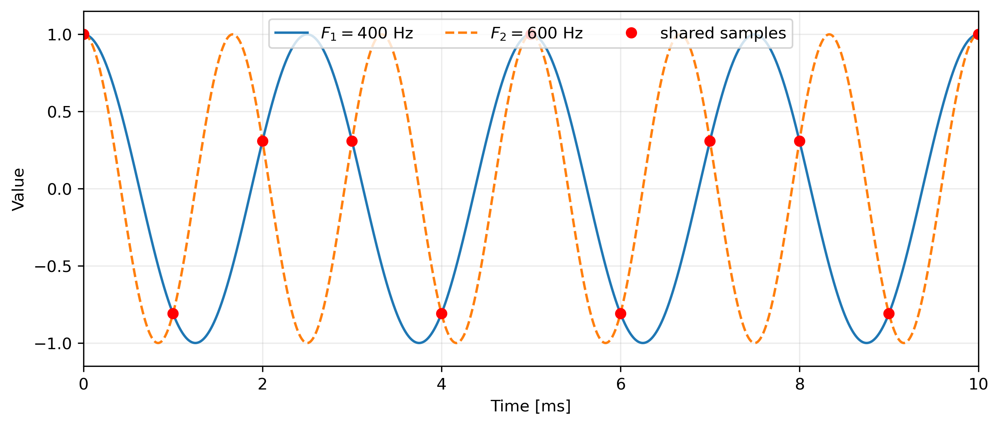{max-width=1000px, height=62%}


### The problem of aliasing

- Sampling different signals can lead to exactly same samples

- Problem: how to know from what signal did the samples come from? Impossible.

- Example:
  - all these discrete frequencies are identical:
    $$ f = -0.4 = 0.6 = 1.6 = ...$$

  - so if $F_s = 1000Hz$, the original signal could have been any frequency $F$ out of: 600Hz or 1600Hz or ...

  - Exercise: check some of these

### Aliasing example - low frequency signal

```{python .cb.run session=plot}
import matplotlib.pyplot as plt, numpy as np, math
t = np.arange(0,1000)                 #
Ts = 80                               # Sampling period Ts=10, sampling freq Fs = 0.1
xa = np.sin(2*math.pi*0.006*t)        # analog signal
td = t[0:1001:Ts]                     # go from 0 to 100 with step=Ts, i.e. 0,10,20,...
xd = xa[td]
plt.plot(t,xa)                       # plotting
plt.stem(td,xd,'--r', use_line_collection=True)
plt.xlim(-20, 1020)
plt.ylim(-1.1, 1.1)
plt.savefig('fig/01_Sampling_AliasingLowFreq.png', transparent=True, bbox_inches='tight', dpi=300)
plt.close()
```
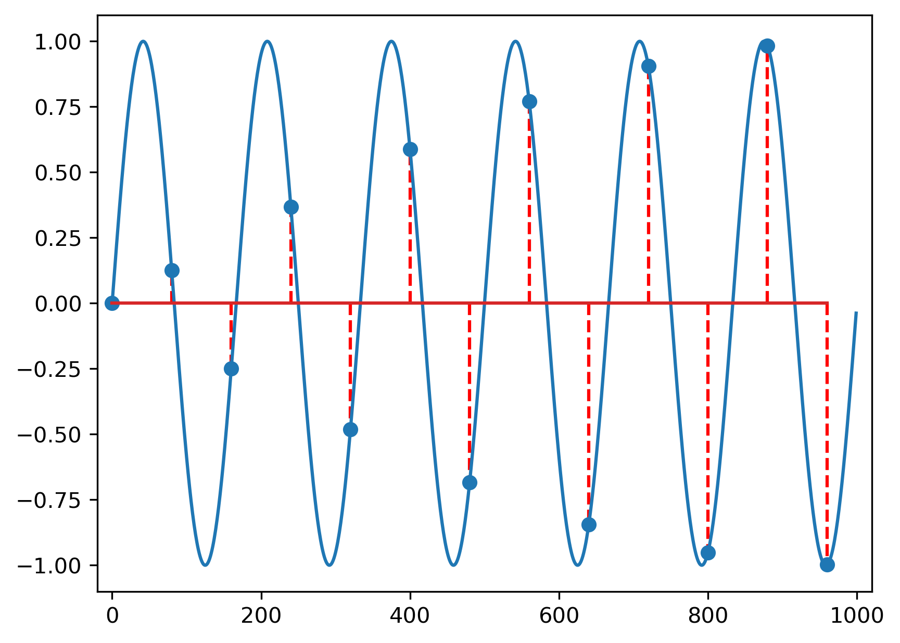{width=100% max-width=1000px}


### Aliasing example - high frequency signal, same samples

```{python .cb.run session=plot}
import matplotlib.pyplot as plt, numpy as np, math
t = np.arange(0,1000)                 #
Ts = 80                               # Sampling period Ts=10, sampling freq Fs = 0.1
xa = -np.sin(2*math.pi*(2/Ts -0.006)*t)        # analog signal
td = t[0:1001:Ts]                     # go from 0 to 100 with step=Ts, i.e. 0,10,20,...
xd = xa[td]
plt.plot(t,xa)                       # plotting
plt.stem(td,xd,'--r', use_line_collection=True)
plt.xlim(-20, 1020)
plt.ylim(-1.1, 1.1)
plt.savefig('fig/01_Sampling_AliasingHighFreq.png', transparent=True, bbox_inches='tight', dpi=300)
plt.close()
```
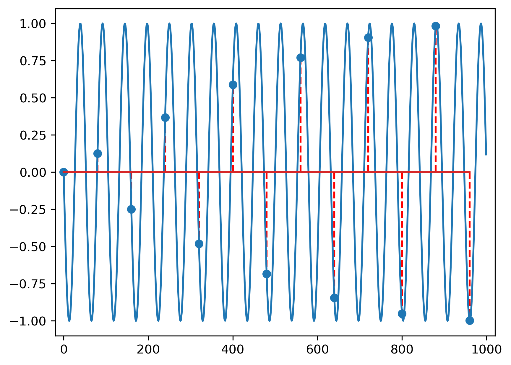{width=100% max-width=1000px}

### Aliasing example - samples only

```{python .cb.run session=plot}
import matplotlib.pyplot as plt, numpy as np, math
t = np.arange(0,1000)                 #
Ts = 80                               # Sampling period Ts=10, sampling freq Fs = 0.1
xa = -np.sin(2*math.pi*(2/Ts -0.006)*t)        # analog signal
td = t[0:1001:Ts]                     # go from 0 to 100 with step=Ts, i.e. 0,10,20,...
xd = xa[td]
###plt.plot(t,xa)                       # plotting
plt.stem(td,xd,'--r', use_line_collection=True)
plt.xlim(-20, 1020)
plt.ylim(-1.1, 1.1)
plt.savefig('fig/01_Sampling_AliasingOnlySamples.png', transparent=True, bbox_inches='tight', dpi=300)
plt.close()
```
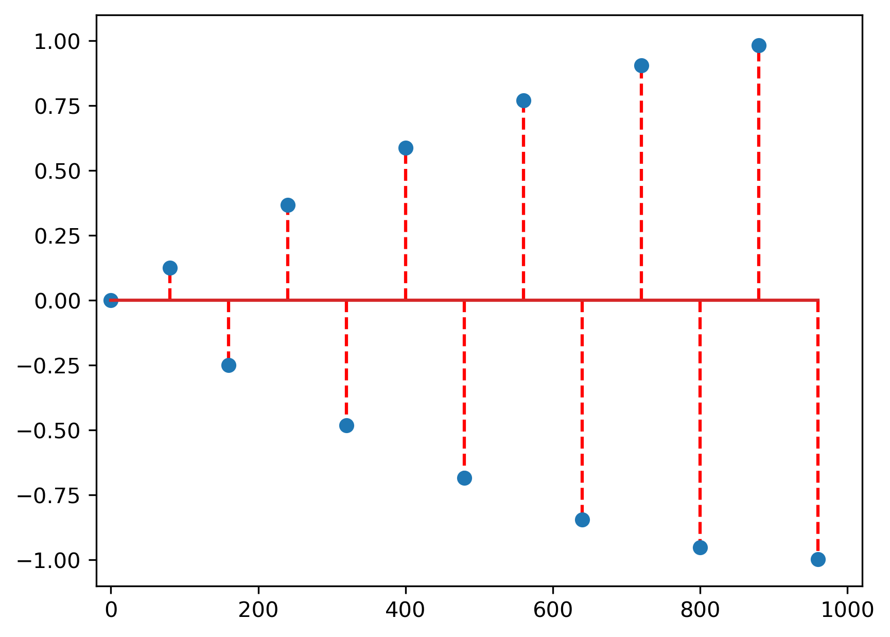{width=100% max-width=1000px}


### Checkpoint: sampling and aliasing

- A 800 Hz cosine is sampled at 1000 Hz. Which cosine in the principal interval has the same samples?

<!-- - Is $F_s=2F_{max}$ sufficient for every signal? -->

\smallskip

<!-- - **Answers:** no; 400 Hz; no
- Sampling, aliasing and quantization are different operations -->


### Anti-alias

- Sampling according to Shannon theorem guarantees no aliasing:

    $$F_s > 2 F_{max} \Rightarrow f = \frac{F}{F_s} < \frac{1}{2}$$

- It is better remove from the signal all the frequencies larger than $\frac{F_s}{2}$,
which will not be sampled correctly, otherwise they will create a false frequency and bring confusion

- **Anti-alias filter**: a low-pass filter situated before a sampling circuit,
rejecting all frequencies $F \geq \frac{F_s}{2}$ from the signal before sampling

    - Standard practice in the design of processing systems

### Ideal signal reconstruction from samples

- Reconstruction = opposite of sampling, producing a continuous signal from a discrete one

- For harmonic signals ($\sin$, $\cos$), the ideal reconstruction equation amounts
with the inverse variable change $n = \frac{t}{T_s} = t \cdot F_s$:

  $$x_r(t) = x[\frac{t}{T_s}] = x[t \cdot F_s]$$

- A discrete frequency $f$ becomes $F = f \cdot F_s$

### Sinc interpolation: ideal reconstruction

- Example: $F=100$ Hz sampled at $F_s=1000$ Hz, safely inside the Nyquist interval
- We use 61 samples and show only the interior; shifted sinc terms sum through every sample value

```{python .cb.run session=plot}
import matplotlib.pyplot as plt, numpy as np

sampling_frequency = 1000
signal_frequency = 100
sample_indices = np.arange(-30, 31)
sample_times = sample_indices / sampling_frequency
samples = np.cos(2 * np.pi * signal_frequency * sample_times)
time = np.linspace(-0.0045, 0.0045, 1801)
sinc_terms = np.sinc(sampling_frequency * time[:, None] - sample_indices[None, :])
reconstructed = sinc_terms @ samples
interpolation_matrix = np.sinc(sample_indices[:, None] - sample_indices[None, :])
assert np.allclose(interpolation_matrix @ samples, samples, atol=1e-12)

plt.figure(figsize=(10, 4))
for selected_index, color in zip((-1, 0, 1), ('tab:blue', 'tab:orange', 'tab:green')):
    position = np.flatnonzero(sample_indices == selected_index)[0]
    contribution = samples[position] * sinc_terms[:, position]
    plt.plot(1000 * time, contribution, ':', color=color, linewidth=1.6,
             label=f'contribution $n={selected_index}$')
plt.plot(1000 * time, np.cos(2 * np.pi * signal_frequency * time),
         color='black', linewidth=2, label='original')
plt.plot(1000 * time, reconstructed, '--', linewidth=2, label='reconstructed sum')
visible = np.abs(sample_indices) <= 4
plt.plot(1000 * sample_times[visible], samples[visible], 'or', label='samples')
plt.xlabel('Time [ms]')
plt.ylabel('Value')
plt.xlim(-4.5, 4.5)
plt.ylim(-1.25, 1.25)
plt.grid(alpha=0.25)
plt.legend(ncol=3, fontsize=10, loc='lower center')
plt.savefig('fig/01_Sampling_SincReconstruction.png', transparent=True, bbox_inches='tight', dpi=300)
plt.close()
```
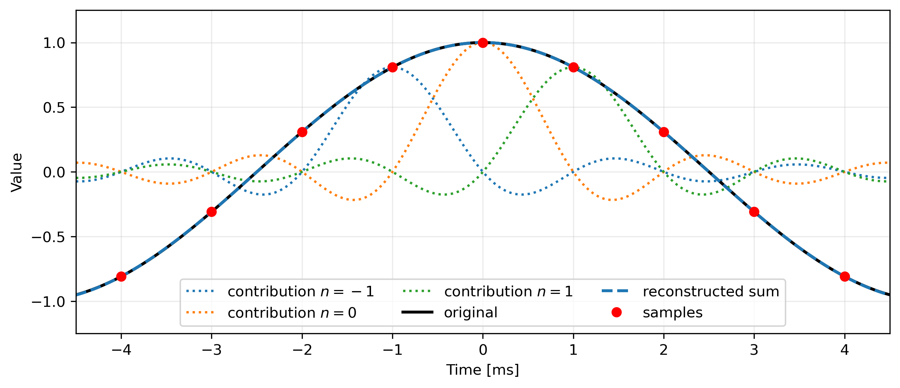{max-width=1000px, height=60%}

### Reconstruction and aliasing

- What value to use for $f$?
   - we know $f = f + 1 = f+2 = ...$, which one to use?

- The reconstruction assumes all $f$ are in the interval $[-\frac{1}{2}, \frac{1}{2})$
   - apply reconstruction equation
   - the resulting signal has all frequencies $\frac{F_s}{2} \leq F < \frac{F_s}{2}$ ($\frac{F_s}{2}$ = "the Nyquist frequency")

- **In exercises:** Always bring $f$ in the interval $[-\frac{1}{2}, \frac{1}{2})$ before reconstruction

- Reconstruction always produces signals with frequencies in $[-\frac{F_s}{2}, \frac{F_s}{2})$
   - Only signals or components sampled according to the sampling theorem will be reconstructed identically
   - Any other components are replaced with their aliased counterparts

### A/D and D/A conversion

- Sampling + quantization + coding is usually done by an **Analog to Digital Converter (ADC)**
    - It takes an analog signal and produces a sequence of binary-coded values

\smallskip

- Reconstructing an analog signal from numeric samples is done by a **Digital to Analog Converter (DAC)**
    - Usually the reconstruction is not based on sampling theorem equation, which is too complicated, but with simpler empirical solutions

\smallskip

- You have ADCs and DACs for any In or Out audio jack (phone, computer etc)

### Signal quantization and coding

- In practice, the amplitudes of the samples are converted to binary representation

- Because of this, the amplitudes are rounded to fixed levels, e.g. 8-bit values (256 distinct levels) , 16-bit values (65536).

- This "rounding" is known as **quantization**

- The "rounding error" is known as **quantization error**

- Converting the value to binary form is known as **coding**

- ADCs handle sampling, quantization and coding simultaneously

### Sampling: formula summary

\small

- Sampling clock: $F_s=\frac{1}{T_s}$
- Sampling equation: $x[n]=x_a(nT_s)$
- Relative frequency: $f=\frac{F}{F_s}$
- Periodicity: $f=\frac{p}{q}$ in lowest terms $\Longleftrightarrow N=q$; irrational $f$ is not periodic
- Nyquist--Shannon condition: $F_s>2F_{max}$
- Frequency equivalence: $f\equiv f+k\pmod 1$, $k\in\mathbb{Z}$; use $f\in[-\frac{1}{2},\frac{1}{2})$
- Sinc interpolation:
  $$x_a(t)=\sum_{n=-\infty}^{+\infty}x[n]\,\frac{\sin(\pi(F_st-n))}{\pi(F_st-n)}$$
- $B$-bit quantization provides $2^B$ amplitude levels
