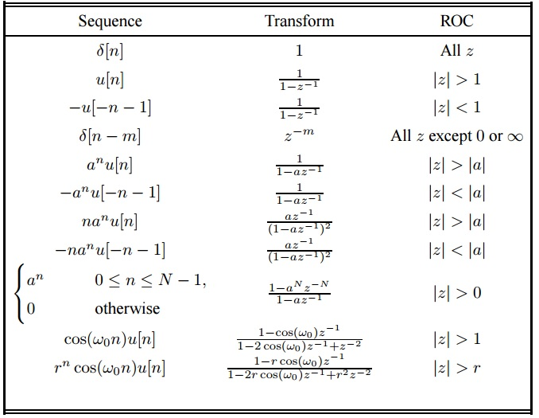
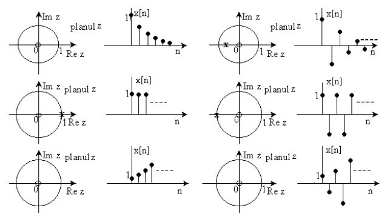
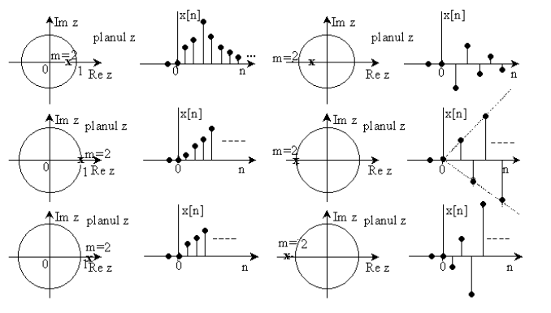
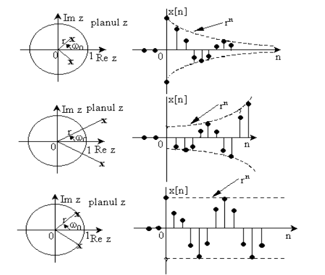

# Chapter III: The Z Transform

## III.1 Introducing the Z transform

### Preliminaries: complex numbers

* real and imaginary part
* **modulus and phase**
* graphical interpretation
* Euler formula
* modulus and phase of $e^{jx}$

### Definition of Z transform

* The Z Transform of a signal $x[n]$, called $X(z)$, is defined as:
$$X(z) = \sum_{-\infty}^\infty x[n] z^{-n}$$

* It is defined only for the values of $z$ where the sum is finite
(called *region of convergence)*

* Notation:
$$\mathcal{Z}\left( x[n] \right) = X(Z)$$
$$x[n] \trZ X(Z)$$

* Similar to the Laplace transform for analog signals

* The Z transform associates **a polynomial** to a signal (think Decision and Estimation class)
* Why?
    * Convolution of two signals = multiplication of polynomials
    * Short descriptions of complicated signals (i.e. exponential signals)

### Examples

$x[n] = {1, 2, 5, 7, 0}$, (with time origin in 1 or in 5)

$\delta[n]$, $\delta[n-k]$, $\delta[n+k]$

$\left(\frac{1}{2}\right)^n$

$x[n] = a^n u[n]$

$x[n] = -a^n u[-n-1]$

### Region of convergence

* For finite-support signals, the CR is the whole Z plane, possibly except 0 or $\infty$

* For causal signals, the CR is *the outside of a circle*:
$$|z| > r_1$$

* For anti-causal signals, the CR is *the inside of a circle*:
$$|z| < r_2$$

* For bilateral signals, both the causal and the anti-causal terms of the sum must converges ---> the CR is the area between two circles:
$$r_1 < |z| < r_2$$

* For finite-support signals, the two "circles" are $0$ and $\infty$

* Two different signals can have the same expression of $X(z)$, but with different RC!
    * RC is an essential part in specifying a Z transform
    * should never be omitted

### The Inverse Z Transform

* From a purely mathematical point of view, $X(z)$ is a complex function
* Proper definition of inverse transform is based on the theory of complex functions

$$X(z) = \sum_{-\infty}^\infty x[k] z^{-k}$$

* Multiply with $z^{n-1}$ and integrate along a contour C inside the Convergence Region:

$$\oint_C X(z) z^{n-1} dz = \oint_C \sum_{-\infty}^\infty x[k] z^{n-k-1} dz = \sum_{-\infty}^\infty x[k] \oint_C z^{n-k-1} dz$$

### The Inverse Z Transform

* The Cauchy integral theorem says that:
$$ \frac{1}{2 \pi j} \oint_C z^{n-k-1} dz= 
\begin{cases}
1, &\mbox{if } k = n \\
0, &\mbox{if } k \neq n
\end{cases}
$$
 * And therefore:
$$x[n] = \frac{1}{2 \pi j} \oint_C X(z) z^{n-1} dz$$

* We will not use this relation in practice, but instead will rely on **partial fraction decomposition**

### Properties of Z transform

#### 1. Linearity

If $x_1[n] \trZ X_1(z)$ with CR1, and $x_2[n] \trZ X_2(z)$ with CR2, then:
$$a x_1[n] + b x_2[n] \trZ a X_1(z) + b X_2(z)$$
and CR is at least the intersection of CR1 and CR2.

Proof: use definition

### Properties of Z transform
#### 2. Shifting in time

If $x[n] \trZ X(z)$ with CR, then:
$$x[n-k] \trZ z^{-k} X(z)$$
with same RC, possibly except $0$ and $\infty$.

Proof: by definition

* valid for all $k$, also for $k < 0$
* delay of 1 sample = $z^{-1}$

### Properties of Z transform
#### 3. Modulation in time

If $x[n] \trZ X(z)$ with CR, then:
$$ e^{j \omega_0 n} x[n] \trZ X \left(e^{- j\omega_0}z \right)$$
with same CR

Proof: by definition

### Properties of Z transform
#### 4. Reflected signal

If $x[n] \trZ X(z)$ with CR $r_1 < |z| < r_2$, then:
$$ x[-n] \trZ X \left( z^{-1} \right)$$
with CR $\frac{1}{r_2} < |z| \frac{1}{r_1}$

Proof: by definition

### Properties of Z transform
#### 5. Derivative of Z transform

If $x[n] \trZ X(z)$ with CR, then:
$$ n x[n] \trZ -z \frac{dX \left( z \right)}{dz}$$
with same CR

Proof: by derivating the difference

### Properties of Z transform
#### 6. Transform of difference

If $x[n] \trZ X(z)$ with CR, then:
$$ x[n] - x[n-1] \trZ (1-z^{-1}) X(z)$$
with same CR except $z=0$.

Proof: using linearity and time-shift property

### Properties of Z transform
#### 7. Accumulation in time

If $x[n] \trZ X(z)$ with CR, then:
$$ y[n] = \sum_{k=-\infty}^{n} x[k] \trZ \frac{X(z)}{(1-z^{-1})}$$
with same CR except $z=1$.

Proof: $x[n] = y[n] - y[n-1]$, apply previous property

### Properties of Z transform
#### 8. Complex conjugation

If $x[n] \trZ X(z)$ with CR, and $x[n]$ is a complex signal, then:
$$ x^*[n] \trZ X^* \left( z^* \right)$$
with same CR except $z=0$.

Proof: apply definition

#### Consequence
If $x[n]$ is a real signal, the poles / zeroes are either real or in 
complex pairs

### Properties of Z transform
#### 9. Convolution in time

If $x_1[n] \trZ X_1(z)$ with CR1, 
and $x_2[n] \trZ X_2(z)$ with CR2, then:
$$ x[n] = x_1[n] * x_2[n] \trZ X(z) = X_1(z) \cdot X_2(z)$$
and CR the intersection of CR1 and CR2.

Proof: use definition

* **Very important property!**
* Can compute the convolution of two signals via the Z transform

### Properties of Z transform
#### 10. Correlation in time

If $x_1[n] \trZ X_1(z)$ with CR1, 
and $x_2[n] \trZ X_2(z)$ with CR2, then:
$$ r_{x_1x_2}[l] = \sum_{n=-\infty}^{\infty} x_1[n] x_2[n-l] \trZ R_{x_1 x_2}(z) = X_1(z) \cdot X_2(z^{-1})$$
and CR the intersection of CR1 and with the CR of $X_2(z^{-1})$ (see reflection property)

Proof: correlation  = convolution with second signal reflected, use convolution and reflection properties

### Properties of Z transform
#### 11. Initial value theorem

If $x[n]$ is a causal signal, then

$$ x[0] = \lim_{z \to \infty}X(z)$$

Proof: 
$$X(z) = \sum_{n=0}^{\infty} x[n] z^{-n} = x[0] + x[1]z^{-1} + x[2]z^{-2} + ...$$
When $z \to \infty$, all terms $z^{-k}$ vanish.

### Common Z transform pairs

* Easily found all over the Internet

## III.2. Z transforms which are Rational Functions

### Rational functions

* Many Z transforms are in the form of a rational function, i.e.
a fraction where
    * numerator = polynomial in $z^{-1}$ or $z$
    * denominator = polynomial in $z^{-1}$ or $z$

$$X(z) = \frac{B(z)}{A(z)} = \frac{\sum_{k=0}^M b_k z^{-k}}{\sum_{k=0}^N a_k z^{-k}} =
\frac{b_0 + b_1 z^{-1}+ b_2 z{-2} + ... + b_M z^{-M}}{a_0 + a_1 z^{-1}+ a_2 z{-2} + ... + a_N z^{-N}}$$   
    
* Example:
$$X(z) = \frac{3 + 2 z^{-1} + 4 z^{-2}}{1 - 5z^{-2} + 7 z^{-4}}$$

### Poles and zeros

* A polynomial is completely determined by its roots and a scaling factor

* **Definition**: the **zeros** of $X(z)$ are the roots of the numerator $B(z)$
* **Definition**: the **poles** of $X(z)$ are the roots of the denominator $A(z)$
* The zeros are usually named $z_1, z_2, ... z_M$, and the poles $p_1, p_2, ... p_N$.

The transform $X(z)$ can be rewritten as:
$$X(z) = \frac{b_0}{a_0} \cdot z^{N-M} \cdot \frac{(z-z_1)...(z-z_M)}{(z-p_1)...(z-z_N)} = \frac{b_0}{a_0} \cdot \frac{(1-z_1 z^{-1})...(1-z_M z^{-1})}{(1-p_1 z^{-1})...(1-z_N z^{-1})}$$

It has:

* M zeros with finite values
* N poles with finite values
* and either N-M zeros in 0, if N > M, or N-M poles in 0, if N < M (trivial poles/zeros)

### Graphical representation
* The graphical representation of poles and zeros in the complex
place is called **the pole-zero plot**
* Graphical: poles = "x", zeros = "0"
* CR cannot contain poles
* Example: at whiteboard

## III.3 Inverse Z transform for rational functions

### Methods for computing the Inverse Z Transform

1. Direct evaluation using the Cauchy integral

$$x[n] = \frac{1}{2 \pi j} \oint_C X(z) z^{n-1} dz$$

2. Decomposition as continuous power series 

3. **Partial fraction decomposition**

### Partial fraction decomposition 

Any rational function 
$$\frac{b_0 + b_1 z^{-1}+ b_2 z{-2} + ... + b_M z^{-M}}{a_0 + a_1 z^{-1}+ a_2 z{-2} + ... + a_N z^{-N}}$$
can be decomposed in **partial fractions**:
$$c_0 + c_1 z^{-1} + ... c_{N-M}z^{-(M-N)} + \frac{A_1}{z-p_1} + ...
\frac{A_N}{z - p_N}$$

* Each pole has a corresponding partial fraction
* First terms appear  if $M\leq N$
* Based on linearity, we invert each term separately (simple)

### Procedure for Inverse Z Transform

$$X(z) = \frac{B(z)}{A(z)}$$

1. If $M \geq N$, divide numerator to denominator to obtain the first terms.
The remaining fraction is $X_1(z) = \frac{B_1(z)}{A(z)}$, with numerator degree
strictly smaller then denominator

2. In the remaining fraction, eliminate the negative powers of $z$ 
by multiplying with $z^N$

3. Divide by $z$, 
$$\frac{X_1(z)}{z} = \frac{B_1(z)}{z A(z)}$$

4. Compute the poles of $\frac{X_1(z)}{z}$ and decompose in partial fractions:
$$\frac{X_1(z)}{z} = \frac{A_1}{z - p_1} + ...$$

### Procedure for Inverse Z Transform

5. Multiply back with $z$:
$${X_1(z)} = A_1 \frac{z}{z - p_1} + ...$$

6. Convert each term back to the time domain

### Computation of partial fractions coefficients

* If all poles are distinct:
$$A_k = (z-p_k)\frac{X(z)}{z} \rvert_{z = p_k}$$

* If poles are in complex conjugate pairs
    * group the two fractions into a single fraction of degree 2

* If there exist **$m$ multiple poles of same value** (pole order $m > 1$):

$$ \frac{A_{1k}}{z-p_k} + \frac{A_{2k}}{(z-p_k)^2} + ... + \frac{A_{mk}}{(z-p_k)^m} $$

$$A_{ik} = \frac{1}{(m-i)!} \frac{d^{m-i}}{dz^{m-i}} \left[ (z-p_k)^m \cdot \frac{X(z)}{z} \right] \rvert_{z=p_k}$$

    * example for m = 2

### Real signals and complex poles/zeros

* Consequence of the complex-conjugate property of Z transform:

* A real signal $x[n]$ can have only 
    * real poles or zeroes 
    * complex poles and zeroes in conjugate pairs, which can
    be grouped into a single term of degree 2, with real coefficients

* If a Z transform has a complex pole / zero without its conjugate pair,
then the corresponding signal $x[n]$ is complex

### Position of poles and time behavior

* A rational Z transform $X(z)$ = sum of partial fractions

$\leftarrow$

The signal $x[n]$ is a sum of exponential signals (for each partial fraction / pole)

* In the following, we will analyze the relation between the
position of the pole and the signal in time

### Position of poles and time behaviour - 1 pole

* Consider a Z transform with **1 pole**, analyze the look of the
corresponding signal

* Consider the pole value is **$a$**
    * Consider only real signals $x[n]$  ---> $a$ is real
    * Consider causal signal $x[n$ ---> CR is $|z| > |a|$

* Therefore the Z transform is of the type:

$$ X(z) = \frac{1}{1 - a z^{-1}} = \frac{z}{z - a}, CR: |z| > |a|$$

* Therefore the signal $x[n]$ is of the type:

$$x[n] = a^n u[n]$$

### Position of poles and time behavior - 1 pole

Scenarios for a single real pole in $a$:

* Pole inside the unit circle ($|a| < 1$) --> exponential decreasing signal
* Pole outside the unit circle ($|a| > 1$) --> exponential increasing signal
* Pole exactly on unit circle ($|a| = 1$) --> not increasing, not decreasing
* Negative pole ($a < 0$)--> alternating signal
* Positive value ($a > 0$) --> non-alternating signal

### Position of poles and time behavior - 1 pole

### Position of poles and time behavior - 1 double pole

$$X(z) = \frac{a z^{-1}}{(1 - a z ^{-1})^2}, CR: |z| > |a|$$
$$x[n] = n a^n u[n]$$

A double pole in $a$:

* Pole inside the unit circle ($|a| < 1$) --> decreasing signal
* Pole outside the unit circle ($|a| > 1$) --> increasing signal
* Pole exactly on unit circle ($|a| = 1$) --> **increasing signal**
* Negative pole ($a < 0$)--> alternating signal
* Positive value ($a > 0$) --> non-alternating signal

### Position of poles and time behavior - 1 double pole

### Position of poles and time behavior - conjugate poles

$$X(z) = \frac{1 - a z^{-1} \cos{\omega_0}}{1 - 2 z ^{-1} \cos{\omega_0} + z^{-2}}, CR: |z| > |a|$$
$$x[n] = n a^n u[n]$$

A pair of complex conjugate poles:

* a sinusoidal with exponential envelope
    * phase of poles --> frequency of sinusoidal signal
    * modulus of poles --> exponential envelope 
    * poles inside unit circle --> decreasing signal
    * poles outside unit circle --> increasing signal
    * poles on unit circle --> oscillating signal, constant amplitude

What if poles are double?

    * poles on unit circle --> increasing signal
    * otherwise similar

### Position of poles and time behavior - conjugate poles

### Position of poles and time behavior

* A Z transform can be decomposed into partial fractions, i.e. separate poles

* Analyzing the individual behavior of poles --> tells something about whole signal

* Conclusions (for real signals, causal):
    * **all poles inside unit circle --> bounded signal**
    * *simple* poles on unit circle --> bounded signal
    * otherwise --> unbounded signal
    * poles inside unit circle, closer to origin --> fast decrease of signal
    * poles inside unit circle, closer to unit circle --> slow decrease of signal

## III.4 LTI systems and the Z Transform

### System function of a LTI system

* Considering a LTI system with $h[n]$, input signal $x[n]$ --> output is convolution

$$y[n] = x[n] * h[n]$$

* In Z transform, convolution = product of transforms

$$Y(z) = X(z) \cdot H(z)$$

* **The system function of a LTI system is the Z transform of the impulse response $h[n]$**

* The system function of a LTI system is:

$$H(z) = \frac{Y(z)}{X(z)}$$

### System function and the difference equation

* Any LTI system is characterized by a **difference equation**:

$$\begin{split}
y[n]
=& -\sum_{k=1}^N a_k y[n-k] + \sum_{k=0}^M b_k x[n-k] \\
=& -a_1 y[n-1] - a_2 y[n-2] -... - a_N y[n-N] + b_0 x[n] + b_1 x[n-1] + ... + b_M x[n-M]
\end{split}$$

or

$$y[n] + \sum_{k=1}^n a_k y[n-k] = \sum_{k=0}^m b_k x[n-k]$$
$$y[n] + a_1 y[n-1] + a_2 y[n-2] +... + a_N y[n-N] = b_0 x[n] + b_1 x[n-1] + ... + b_M x[n-M]$$

### System function and the difference equation

* The system function $H(z)$ can be derived directly from the difference equation:
$$Y(z) \left( 1 + \sum_{k=1}^N a_k z^{-k} \right) = X(z) \left( \sum_{k=0}^M b_k z^{-k} \right)$$
$$H(z) = \frac{Y(z)}{X(z)} =  \frac{ \sum_{k=0}^M b_k z^{-k} }{ 1 + \sum_{k=1}^N a_k z^{-k} }$$

### Particular cases of system functions

* FIR systems: $a_k = 0$
    * has only zeroes, no poles (all-zero system)
$$H(z) = \frac{Y(z)}{X(z)} = \sum_{k=0}^M b_k z^{-k}$$

* All-pole system: $b_k = 0, k \geq 1$ (must have at least $b_0 \neq 0)$
    * has only poles
$$H(z) = \frac{Y(z)}{X(z)} =  \frac{ b_0 }{ 1 + \sum_{k=1}^N a_k z^{-k} }$$

* Otherwise, in general, we have a *pole-zero system*, with both poles and zeroes

### Output of the system, no initial conditions

* Consider a causal LTI system with initial conditions  = 0 (relaxed system)
    * Remember: I.C. are relevant for IIR implementations ($y[n-k$ part),
    not FIR

* Input signal:
$$x[n] \trZ X(z) = \frac{N(z)}{Q(z)}$$

* Impulse response / System function:
$$h[n] \trZ H(z) = \frac{B(z)}{A(z)}$$

* Output signal:
$$y[n] = x[n] * h[n] \trZ Y(z) = X(z)H(z) = \frac{N(z)B(z)}{Q(z)A(z)}$$

* Some poles and zeros might simplify, if exactly identical

### Natural and forced response

* Assume all poles are *simple* (i.e. no multiplicity)
* Assume all poles $\neq$ all zeros, so no simplification

* Call the poles of $X(z)$ $q_i$ and the poles of $H(z)$, $p_i$

* Then 
$$Y(z) = \sum_{k=1}^N \frac{A_k}{1-p_k z^{-1}} + \sum_{k=1}^L \frac{Q_k}
{1-q_k z^{-1}} $$

and $y[n]$ is

$$y[n] = \underbrace{\sum_{k=1}^N A_k (p_k)^n u[n]}_{natural \; response} + 
\underbrace{\sum_{k=1}^L Q_k (q_k)^n u[n]}_{forced \; response}$$

### Natural and forced response

* Natural response $y_{nr}[n]$ = the part given by the poles **of the system**
* Forced response $y_{fr}[n]$ = given by the poles **of the input signal**

* This output is the **zero-state response** of the system (no initial conditions)

* If some poles have higher multiplicity, the formulas will be slightly changed

### Output of the system, with initial conditions 

* The input signal is causal and applied at moment $n=0$
* The output signal is causal and is computed starting from $n=0$
* We have initial conditions $y[-1], y[-2], ... y[n-N]$

* Where do initial condition appear in the Z transform?

### Unilateral Z transform

* Initial conditions appear here

$$y[n] \trZ Y(z) = \sum_{n=0}^{\infty} y[n] z^{-n}$$
$$\begin{split}
y[n-k] \trZ &\sum_{n=0}^{\infty} y[n-k] z^{-n} = \\
=&\sum_{m=-k}^{\infty} y[m] z^{-m-k}\\
=&z^{-k}(\sum_{m=0}^{\infty} y[m] z^{-m} + \sum_{m=1}^k y[-m]z^m)\\
=&\underbrace{z^{-k}Y(z)}_{normal} + z^{-k}\sum_{n=1}^k \underbrace{y[-n]}_{I.C.} z^n
\end{split}$$

* This is known as the *unilateral Z transform*, shifting in time

### Output of the system

* Replacing this in the system's difference equation
$$y[n] + \sum_{k=1}^n a_k y[n-k] = \sum_{k=0}^m b_k x[n-k]$$
yields
$$Y(z) \left( 1 + \sum_{k=1}^N a_k z^{-k} \right) + \sum_{k=1}^N a_k z^{-k} \sum_{n=1}^k y[-n]z^n = X(z) \left( \sum_{k=0}^M b_k z^{-k} \right)$$

$$Y(z) = \frac{\sum_{k=0}^M b_k z^{-k}}{1 + \sum_{k=1}^N a_k z^{-k}} + 
\frac{-\sum_{k=1}^N a_k z^{-k} \sum_{n=1}^k y[-n]z^n }{1 + \sum_{k=1}^N a_k z^{-k}}$$

* Therefore
$$\boxed{Y(z) = H(z) X(z) + \frac{N_0(z)}{A(z)}}$$
with
$$N_0(z) = -\sum_{k=1}^N a_k z^{-k} \sum_{n=1}^k y[-n]z^n $$

### Zero-state and zero-input outputs

* The first part = **zero-state response** (state = initial conditions = 0)
* The second part = **zero-input response** (when no input)

* Total output = sum of all components

* But zero-input response has the same poles as the system function, so
$$y_{zi}[n] = \sum_{k=1}^N D_k (p_k)^n u[n]$$

* **Zero-input response is just like natural response, with different coefficients**
    * The initial conditions just change the coefficients of the system's natural response

### Transient and permanent response

* For a stable system, all system poles $|p_k| < 1$, so natural response (including initial conditions) is made of decreasing exponentials 
* ** For a stable system, the natural response dies out exponentially**
* The natural response is called a **transient response**

* Input signals typically last longer, or infinitely (poles on the unit circle) --> the forced response is a **permanent response**

* Operating regimes:
    * when the input signal is first applied, and the transient response is present, the system is in **transient regime**
    * When the transient response has died out, the system remains in **permanent regime**, where only the input signal determines the output

* Example: apply a infinitely long sinusoidal, starting from $n=0$

### Stability of a system and H(z)

* Stable system: bounded input --> bounded output

* Reminder: A system is stable if
$$\sum |h[n]| < \infty (convergent)$$

* For a stable system, with $H(z)$

$$ |H(z)| \leq \sum |h[n]| \cdot |z^{-n}| \leq \sum |h[n]| < \infty$$

considering $|z|=1$, i.e. **on the unit circle**.

* **A LTI system is stable if the unit circle in inside the Convergence Region**
    * one can prove the reciprocal, so there is equivalence

* If the system is causal, CR = exterior of a circle given by the largest pole, so all poles must be inside unit circle

* **A *causal* LTI system is stable if all the poles are inside the unit circle**

### Stability of a system and H(z)

* Alternative explanation: if one pole is outside unit circle, the term
corresponding to its partial fraction will be increasing --> whole signal is unbounded

