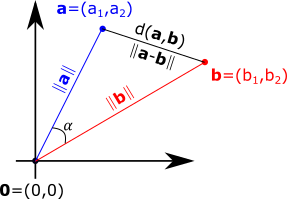
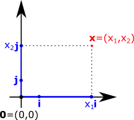
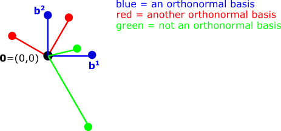
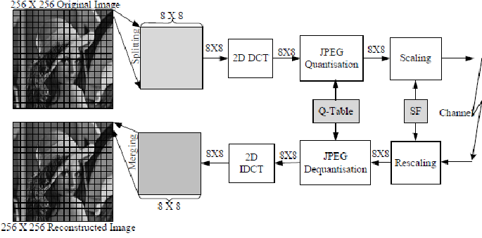
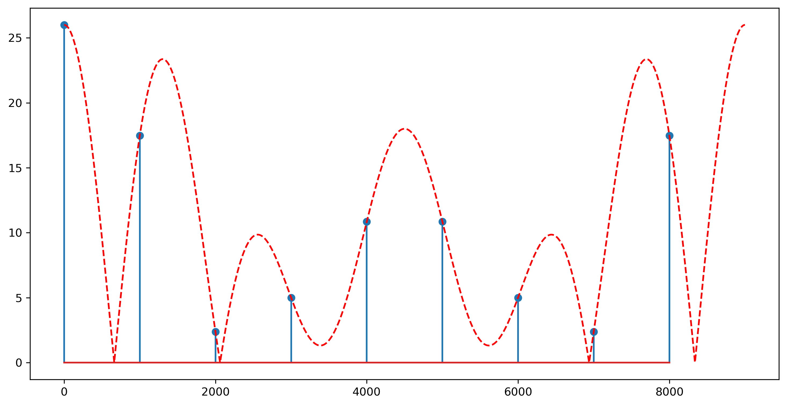

# Chapter IV: The Fourier Transform and its applications

## IV.1 Vector spaces of signals (crash course)

### Vector spaces

- **Vector space** = a set $V \lbrace v_i \rbrace$ with the following two properties:

    - one element  + another element = still an element of the same space

    - a scalar constant $\times$ an element = still an element of the same space

- You **can't escape** a vector space by summing or scaling

- The elements of a vector space are called **vectors**

### Examples of vector spaces

- Geometric spaces are great intuitive examples:

    - a line, or the set $\mathbb{R}$   (one-dimensional)
    - a plane, or the set $\mathbb{C}$   (two-dimensional)
    - 3D space  (three-dimensional)
    - 4D space  (four-dimensional, like the spatio-temporal universe)
    - arrays with N numbers (N-dimensional)
    - space of continuous signals ($\infty$-dimensional)

- The **dimension** of the space = "how many numbers you need in order to specify one element" (informal)

- A "vector" like in maths = a sequence of $N$ numbers = a "vector" like in programming

  - e.g. a point in a plane has two coordinates = a vector of size $N=2$
  - e.g. a point in a 3D-space has three coordinates = a vector of size $N=3$

### Inner product

- Many vector spaces have a fundamental operation: **the (Euclidean) inner product**

    - for **discrete** signals:
        $$\langle \vec{x},\vec{y} \rangle = \sum_i x_i y_i^*$$

    - for **continuous** signals:
        $$\langle \vec{x},\vec{y} \rangle = \int x(t) y^*(t)$$

- $^*$ represents **complex conjugate** (has no effect for real signals)

- The result is one number (real or complex)

- Also known as **dot product** or **scalar product** ("produs scalar")

### Inner product

- Each entry in $\vec{x}$ times the complex conjugate of the one in $\vec{y}$, all summed

- For discrete signals, it can be understood as a row $\times$ column multiplication

- Discrete vs continuous: just change sum/integral depending on signal type

### Inner product properties

- Inner product is **linear** in both terms:

    $$\langle \vec{x_1} + \vec{x_2}, \vec{y} \rangle = \langle \vec{x_1}, \vec{y} \rangle + \langle \vec{x_2}, \vec{y} \rangle$$
    $$\langle c \cdot \vec{x}, \vec{y} \rangle = c \cdot \langle \vec{x_1}, \vec{y} \rangle$$
    $$\langle \vec{x}, \vec{y_1} + \vec{y_2} \rangle = \langle \vec{x}, \vec{y_1} \rangle + \langle \vec{x}, \vec{y_2} \rangle$$
    $$\langle \vec{x}, c \cdot \vec{y} \rangle = c^* \cdot \langle \vec{x_1}, \vec{y} \rangle$$


### The distance between two vectors

- An inner product induces a **norm** and a **distance** function

- **The (Euclidean) distance** between two vectors =
    $$d(\vec{x}, \vec{y}) = \sqrt{(x_1-y_1)^2 + (x_2-y_2) ^2 + ... + (x_N-y_N) ^2}$$

- This distance is the **usual geometric distance** you know from geometry

- It has the exact same intuition like in **normal geometry**:

  - if two vectors have small distance, they are close, they are similar
  - two vectors with large distance are far away, not similar
  - two identical vectors have zero distance

### The norm of a vector

- An inner product induces a **norm** and a **distance** function

- The **norm** (length) of a vector = sqrt(inner product with itself)
$$\|\vec{x}\| = \sqrt{ \langle \vec{x},\vec{x} \rangle } = \sqrt{x_1^2 + x_2 ^2 + ... + x_N ^2}$$

- The **norm** of a vector is the distance from $\vec{x}$ to point $\vec{0}$.

- It has the exact same intuition like in **normal geometry**:

  - vector has large norm = has big values, is far from $\vec{0}$
  - vector has small norm = has small values, is close to $\vec{0}$
  - vector has zero norm = it is the vector $\vec{0}$

- Norm of a vector = sqrt(the signal **energy**)

### Norm and distance

- The norm and distance are related

- The distance between $\vec{a}$ and $\vec{b}$ = norm (length) of their difference
$$d(\vec{x}, \vec{y}) = \|\vec{x} - \vec{y}\| = \sqrt{x_1^2 + x_2 ^2 + ... + x_N ^2}$$

- Just like in geometry: distance = length of the difference vector

{width=42%}

### Angle between vectors

- The **angle** between two vectors is:

  $$\cos(\alpha) = \frac{\langle x,y \rangle}{||x|| \cdot ||y||}$$

    - is a value between -1 and 1

- **Otrhogonal vectors** = two vectors with $\langle x,y \rangle = 0$

   - their angle = $90\deg$
   - in geometric language, the two vectors are **perpendicular**

### Why vector space

- Why are all these useful?

- They are a very general **framework** for different kinds of signals

- We can have **generic** algorithms expressed in terms of distances, norms, angles,
and they will work the same in all vector spaces

  - Example in DEDP class: ML decision with 1, 2, N samples

### Vector spaces in DSP class

We deal mainly with the following vector spaces:

- The vector space of all infinitely-long real signals $x[n]$

- The vector space of all infinitely-long periodic signals $x[n]$ with period N

  - for each $N$ we have a different vector space

- The vector space of all finite-length signals $x[n]$ with only $N$ samples

  - for each $N$ we have a different vector space

### Bases

- A **basis** = a set of $N$ linear independent elements from a vector space

  $$B = \lbrace \vec{b}^1, \vec{b}^2 ... \vec{b}^N \rbrace$$

- Any vector in a vector space is expressed as a **linear combination** of the basis elements:

  $$\vec{x} = \alpha_1 \vec{b}^1 + \alpha_2 \vec{b}^2 + ... + \alpha_N \vec{b}^N$$

- The vector is defined by these coefficients:

  $$\vec{x} = (\alpha_1, \alpha_2, ... \alpha_N)$$

### Bases and coordinate systems

- Bases are just like **coordinate systems** in a geometric space

  - any point is expressed w.r.t. a coordinate system
  $$\vec{x} =  x_1 \vec{i} + x_2 \vec{j}$$

  - any vector is expressed w.r.t. a basis
  $$\vec{x} = \alpha_1 \vec{b}^1 + \alpha_2 \vec{b}^2 + \dots + \alpha_N \vec{b}^N$$

- $N$ = The number of basis elements = The dimension of the space

- Example: any color = RGB values (monitor) or Cyan-Yellow-Magenta values (printer)

### Bases and coordinate systems




### Choice of bases

- There is typically an infinite choice of bases

- The **canonical basis** = all basis vectors are full of zeros, just with one 1

- You used it already in an exercise:

  - any signal $x[n]$ can be expressed of a sum of $\delta[n-k]$
  $$\lbrace \dots, 3, 6, 2, \dots \rbrace = \dots + 3 \delta[n] + 6 \delta[n-1] + 2 \delta[n-2] + \dots$$

  - the canonical basis is $B = \lbrace ..., \delta[n], \delta[n-1], \delta[n-2], \dots \rbrace$

### Orthonormal bases

- An **orthonormal basis** a basis where all elements $\vec{b}^i$ are:

  - orthogonal to each other:  $$\langle \vec{b}^i, \vec{b}^j \rangle = 0, \forall i \neq j$$

  - **normalized** (their norm = 1): $$||\vec{b}^i|| = \sqrt{\langle \vec{b}^i, \vec{b}^i \rangle} = 1, \forall i$$

- Example: the canonical basis $\lbrace \delta[n-k] \rbrace$ is orthonormal:

  - $\langle \delta[n-k], \delta[n-l] \rangle = 0, \forall k \neq l$
  - $\langle \delta[n-k], \delta[n-k] \rangle = 1, \forall k$


### Orthonormal bases

- Orthonormal basis = like a coordinate system with orthogonal vectors, of length 1

{width=80%}


### Basis expansion of a vector

- Suppose we have an **orthonormal basis** $B = \lbrace \vec{b}^i \rbrace$

- Suppose we have a vector $\vec{x}$

- We can write (expand) $\vec{x}$ as:
  $$\vec{x} = \alpha_1 \vec{b}^1 + \alpha_2 \vec{b}^2 + \dots + \alpha_N \vec{b}^N$$

- Question: how to **find** the coefficients $\alpha_i$?

### Basis expansion of a vector

- If the basis is **orthonormal**, we have:

$$\begin{split}
\langle \vec{x}, \vec{b}^i \rangle =&
\langle \alpha_1 \vec{b}^1 + \alpha_2 \vec{b}^2 + \dots + \alpha_N \vec{b}^N, \vec{b}^i \rangle\\
&= \langle \alpha_1 \vec{b}^1, \vec{b}^i \rangle + \langle \alpha_2 \vec{b}^2, \vec{b}^i \rangle + \dots + \langle \alpha_N \vec{b}^N, \vec{b}^i \rangle\\
&= \alpha_1 \langle \vec{b}^1, \vec{b}^i \rangle + \alpha_2 \langle \vec{b}^2, \vec{b}^i \rangle + \dots + \alpha_N\langle \vec{b}^N, \vec{b}^i \rangle\\
&= \alpha_i
\end{split}$$

### Basis expansion of a vector

- Any vector $\vec{x}$ can be written as:
  $$\vec{x} = \alpha_1 \vec{b}^1 + \alpha_2 \vec{b}^2 + \dots + \alpha_N \vec{b}^N$$

- For orthonormal basis: the coefficients $\alpha_i$ are found by inner product
with the corresponding basis vector:
  $$\alpha_i = \langle, \vec{x}, \vec{b}^i \rangle$$


### Why bases

- How does all this talk about bases help us?

- To better understand the Fourier transform

- The signals $\lbrace e^{j \omega n} \rbrace$ form an **orthonormal basis**

- The Fourier Transform of a signal $x$ = finding the coefficients of $\vec{x}$ in this basis

- The Inverse Fourier Transform = expanding $\vec{x}$ with the elements of this basis

- Same **generic** thing every time, only the type of signals differ


## IV.2 Introducing the Fourier Transforms

### Reminder

- Reminder:

$$e^{jx} = \cos(x) + j \sin(x)$$

$$\cos(x) = \frac{e^{jx} + e^{-jx}}{2}$$

$$\sin(x) = \frac{e^{jx} - e^{-jx}}{2j}$$

$$\sin(x) = \cos(x - \frac{\pi}{2})$$

$$\cos(x) = \sin(x + \frac{\pi}{2})$$

### Why sinusoidal signals

- Why are sinusoidal signals $\sin()$ and $\cos()$ **so prevalent** in signal processing?

- Answer: because they are combinations of an $e^{jx}$ and an $e^{-jx}$

- Why are these $e^{jx}$ so special?

- Answer: because they are **eigen-functions** of linear and time-invariant (LTI) systems

### Response of LTI systems to harmonic signals

- Consider an LTI system with $h[n]$

- Input signal = complex harmonic (exponential) signal
$x[n] = A e^{j \omega_0 n}$

- Output signal = convolution
$$\begin{split}
y[n] &= \sum_{k=-\infty}^\infty h[k] x[n-k]\\
&= \sum_{k=-\infty}^\infty h[k] e^{-j \omega_0 k} A e^{j \omega_0 n}\\
&= H(\omega_0) \cdot x[n]
\end{split}$$

- Output signal = input signal $\times$ a (complex) constant ($H(\omega_0)$)

### Eigen-function

- **Eigen-function** of a system ("funcție proprie") =
a function $f$ which, if input in a system,
produces an output proportional to it
    $$H\lbrace f \rbrace = \lambda \cdot f, \lambda \in \mathbb{C}$$

    - just like **eigen-vectors** of a matrix (remember algebra): $A \mathbb{v} = \lambda \mathbb{v}$
    - we call the "functions" to allow for continuous signals as well

- Complex exponential signals $e^{j\omega t}$ (or $e^{j\omega n}$) are **eigen-functions** of Linear and Time Invariant (LTI) systems:

    - output signal = input signal $\times$ a (complex) constant

### Representation with respect to eigen-functions (-vectors)

- We can understand the effect of a LTI system very easily
 if we **decompose all signals $x[n]$ as a combination of
 $\lbrace e^{j \omega n} \rbrace$**

- Example: RGB color filter

   - suppose we have some photographic filters (lenses):
      - one reduces red to 50%
      - one reduces green to 25%
      - one reduces blue to 80%
      - RGB are eigen-functions of the system: input = 200 Blue, output = 0.8 * 200 Blue
      - what is the output color if input is "pink"?
      - Answer is easy if we represent all colors in RGB

### Representation with respect to eigen-functions (-vectors)

- We can understand the effect of a LTI system **very easily** if we decompose all signals as a combination of $\lbrace e^{j \omega n} \rbrace$

- All vector space theory becomes useful now:

  - $\lbrace e^{j \omega n} \rbrace$ is an **orthonormal basis**
  - decomposing signals = finding coefficients $\alpha_i$
  - we know how to do this, just like for any orthonormal basis

  $$x[n] = \sum \alpha_\omega \cdot e^{j \omega n}$$
  $$\alpha_\omega = \langle x, e^{j \omega n} \rangle$$


### Discrete-Time Fourier Transform (DTFT)

- Consider the vector space of **non-periodic infinitely-long signals**

- This vector space is **infinite-dimensional**

- The signals $\lbrace e^{j 2 \pi f n} \rbrace, \forall f \in [-\frac{1}{2}, \frac{1}{2}]$ form an **orthonormal basis**

- We can expand (almost) any $\vec{x}$ in this basis:

  $$x[n] = \int_{f=-1/2}^{1/2} \underbrace{X(f)}_{\alpha_\omega} e^{j 2 \pi f n} df$$

- The coefficient of every $e^{j 2 \pi f n}$ is found by inner product:

  $$\alpha_\omega = X(f) = \langle x[n], e^{j 2 \pi f n} \rangle = \sum_n x[n] e^{- j 2 \pi f n}$$


### Discrete-Time Fourier Transform (DTFT)

**Inverse Discrete-Time Fourier Transform (DTFT)**
  $$x[n] = \int_{f=-1/2}^{1/2} X(f) e^{j 2 \pi f n} df$$

  - A signal $x[n]$ can be written as a linear combination of $\lbrace e^{j 2 \pi f n} \rbrace, \forall f \in [-\frac{1}{2}, \frac{1}{2}]$, with some coefficients $X(f)$


**Discrete-Time Fourier Transform (DTFT)**
  $$X(f) = \langle x[n], e^{j 2 \pi f n} \rangle = \sum_{n=-\infty}^{\infty} x[n] e^{- j 2 \pi f n}$$

  - The coefficient $X(f)$ of every $\lbrace e^{j 2 \pi f n} \rbrace$ is found using the inner product $\langle \vec{x}, e^{j 2 \pi f n} \rangle$

### Discrete-Time Fourier Transform (DTFT)

- Alternative form with $\omega$

- We can replace $2 \pi f = \omega$, and $df = \frac{1}{2 \pi} d\omega$

  $$x[n] = \frac{1}{2 \pi}\int_{\omega=-\pi}^{\pi} X(\omega) e^{j \omega n} d\omega$$

  $$X(\omega) = \langle x[n], e^{j \omega n} \rangle = \sum_n x[n] e^{- j \omega n}$$


### Discrete-Time Fourier Transform (DTFT)

- A non-periodic signal $x[n]$ has a **continuous spectrum** $X(\omega)$, with $f \in [-\frac{1}{2}, \frac{1}{2}]$

  - e.g. $\omega \in [-\pi, \pi]$


### Discrete Fourier Transform (DFT)

- Consider the vector space of **periodic** signals with **period N**
  - for some fixed $N =$ 2, 3 or ... etc

- This is a vector space of **dimension N**
  - we need N numbers to identify a signal (specify its period)

- We can consider $x[n]$ only for **one period**, i.e. $n = 0 ,\dots N-1$

- The signals $\lbrace e^{j 2 \pi f n} \rbrace, \forall f \in \lbrace 0, \frac{1}{N}, \dots \frac{N-1}{N} \rbrace$ form an **orthonormal basis** with N elements

- It is a **discrete** set of frequencies: $f = \frac{k}{N}, \forall k \in \lbrace 0, 1, \dots N-1 \rbrace$

### Discrete Fourier Transform (DFT)

**Inverse Discrete Fourier Transform**
  $$x[n] = \frac{1}{N} \sum_{k=0}^{N-1} X_k e^{j 2 \pi k n / N}$$

  - A periodic signal $x[n]$ can be written as a linear combination of $k$ signals $\lbrace e^{j 2 \pi k n / N} \rbrace$, with some coefficients $X_k$

**Discrete Fourier Transform**
  $$X_k = \langle x[n], e^{j 2 \pi f n} \rangle = \sum_{n=0}^{N-1} x[n] e^{- j 2 \pi k n / N}$$

  - The coefficient $X(f)$ of every $\lbrace e^{j 2 \pi f n} \rbrace$ is found using the inner product $\langle \vec{x}, e^{j 2 \pi f n} \rangle$


### Discrete Fourier Transform (DFT)

- A periodic signal $x[n]$ with period $N$ has a **discrete spectrum** $X(\omega)$ composed of only $N$ frequencies $\lbrace 0, \frac{1}{N} \dots \frac{N-1}{N} \rbrace$

- Each frequency $\frac{k}{N}$ has a **coefficient** $X_k$

  - also written as $c_k$

  - The N coefficients $X_k$ are the equivalent of $X(\omega)$

- It is also known as the "Fourier Series for Discrete Signals"

## IV.3 The Discrete-Time Fourier Transform (DTFT)

### Definition

Definitions (again):


**Inverse Discrete-Time Fourier Transform (DTFT)**
  $$x[n] = \int_{f=-1/2}^{1/2} X(f) e^{j 2 \pi f n} df = \frac{1}{2\pi} \int_{\omega=-\pi}^{\pi} X(\omega) e^{j \omega n} d\omega$$


**Discrete-Time Fourier Transform (DTFT)**
  $$X(f) = \langle x[n], e^{j 2 \pi f n} \rangle = \sum_{n=-\infty}^{\infty} x[n] e^{- j 2 \pi f n}$$


### Basic properties of DTFT

- $X(\omega)$ is **defined** only for $\omega \in [-\pi, \pi]$
  - or $f \in [-\frac{1}{2}, \frac{1}{2}]$

- $X(\omega)$ is **complex** (has $| X(\omega) |$, $\angle X(\omega)$)

- If the signal $x[n]$ is real, $X(\omega)$ is **even**
  $$x[n] \in \mathbb{R} \rightarrow X(-\omega) = X^*(\omega)$$

  - This means:

    - modulus is even: $|X(\omega)| = |X(-\omega)|$
    - phase is odd: $X(\omega) = - X(-\omega)$


### Expressing as sum of sinusoids

- Grouping terms with $e^{j \omega n}$ and $e^{j (-\omega) n}$ we get:

  $$\begin{split}
  x[n] &= \frac{1}{2\pi} \int_{-\pi}^0 X(\omega) e^{j \omega n} + \frac{1}{2\pi} \int_0^\pi X(\omega) e^{j \omega n} d\omega\\
       &= \frac{1}{2\pi} \int_0^\pi (X(\omega) e^{j \omega n}  + X(-\omega) e^{j (-\omega) n} ) d\omega\\
       &= \frac{1}{2\pi} \int_0^\pi 2|X(\omega)| ( e^{j \omega n + \angle{X(\omega)}}  +  e^{- j \omega n - \angle{X(\omega)}} ) d\omega\\
       &= \frac{1}{2\pi} \int_0^\pi 2 |X(\omega)| \cos(\omega n + \angle X(\omega))d\omega
  \end{split}$$

- Any signal $x[n]$ is **a sum of sinusoids with all frequencies** $f \in [0, \frac{1}{2}]$, or $\omega \in [0, \pi]$

### Expressing as sum of sinusoids

- The DTFT shows that any signal $x[n]$ is **a "sum" of sinusoids with all frequencies** $f \in [0, \frac{1}{2}]$, or $\omega \in [0, \pi]$

  - this is the fundamental practical interpretation of the Fourier transform
  - not really a sum, because we have an integral

- The **modulus** $|X(\omega)|$ gives the **amplitude** of the sinusoids ($\times$ 2)

    - for $\omega = 0$, $|X(\omega=0)|$ = the DC component

- The **phase** $\angle X(\omega)$ gives the initial phase


### Properties of DTFT

#### 1. Linearity

$$a \cdot x_1[n] + b\cdot x_2[n] \leftrightarrow a \cdot X_1(\omega)+ b\cdot X_2(\omega)$$

Proof: via definition

### Properties of DTFT

####  2. Shifting in time

$$x[n - n_0] \leftrightarrow e^{-j \omega n_0} X(\omega)$$

Proof: via definition

* The amplitudes $|X(\omega)|$ is not affected, shifting in time affects only the phase

### Properties of DTFT

#### 3. Modulation in time
$$e^{j \omega_0 n} x[n]\leftrightarrow X(\omega - \omega_0)$$

#### 4. Complex conjugation

$$x^*[n] \leftrightarrow X^*(-\omega)$$

### Properties of DTFT

#### 5. Convolution

$$x_1[n] * x_2[n] \leftrightarrow X_1(\omega) \cdot X_2(\omega)$$

* Not circular convolution, this is the normal convolution

### Properties of DTFT

#### 6. Product in time

Product in time $\leftrightarrow$ convolution of Fourier transforms
$$x_1[n] \cdot  x_2[n] \leftrightarrow \frac{1}{2 \pi} \int_{-\pi}^\pi X_1(\lambda) X_2(\omega - \lambda) d\lambda$$

### Properties of DTFT

#### Correlation theorem

$$r_{x_1x_2}[l] \leftrightarrow X_1(\omega) X_2^\star(\omega)$$

#### Wiener Khinchin theorem

Autocorrelation of a signal $\leftrightarrow$ Power spectral density
$$r_{xx}[l] \leftrightarrow S_{xx}(\omega) = |X(\omega)|^2$$

### Parseval theorem

- **Parseval theorem**: energy of the signal is the same in time and frequency domains
  $$E = \sum_{-\infty}^\infty |x[n]|^2 = \frac{1}{2 \pi}\int_{-\pi}^\pi |X(\omega)|^2$$

- Is true for all orthonormal bases

## IV.4 The Discrete Fourier Transform (DFT)

### Definitions

Definitions (again):

**Inverse Discrete Fourier Transform (DFT)**
  $$x[n] = \frac{1}{N} \sum_{k=0}^{N-1} X_k e^{j 2 \pi k n / N}$$

**Discrete Fourier Transform (DFT)**
  $$X_k = \langle x[n], e^{j 2 \pi f n} \rangle = \sum_{n=0}^{N-1} x[n] e^{- j 2 \pi k n / N}$$

- DFT is defined for periodical signals with period $N$
- there are exactly N terms in each sum

### Definitions

To remember:

- DFT: takes a vector with N elements ($x[n]$), produces a vector with N elements ($X_k$)
  - for this reason, we can compute it e.g. with Matlab

\smallskip

- DTFT: takes a vector with $\infty$ elements ($x[n]$), produces a continuous function ($X(\omega)$) between $[-\pi, -pi]$

### Periodicity and notation

- DTFT has only $N$ coefficients $X_k$, each $X_k$ corresponding to a frequency $f = \frac{k}{N}$

- In frequency domain, $f = \frac{N-k}{N} = \frac{-k}{N}$  (aliasing, we can always add/subtract 1 from $f$)

- So we can consider $X_{N-k}$ as $X_{-k}$, due to periodicity

- Example: a signal with period $N = 6$ has 6 DFT coefficients

   - we can call them $X_0$, $X_1$, $X_2$, $X_3$, $X_4$, $X_5$
   - we have $X_5 = X_{-1}$, $X_4 = X_{-2}$
   - we can also call them $X_{-2}$, $X_{-1}$, $X_0$, $X_1$, $X_2$, $X_3$

### Basic Properties of the DFT

- Has only $N$ coefficients $X_k$

- $X_k$ are **complex** (has $| X_k |$, $\angle X_k$)

- If the signal $x[n]$ is real, the coefficients are **even**
  $$x[n] \in \mathbb{R} \rightarrow X_{-k} = X_k^*$$

  - This means:

    - modulus is even: $|X_k| = |X_{-k}|$
    - phase is odd: $\angle X_{-k} = -\angle X_k$

### Expressing as sum of sinusoids, N = odd

- Grouping terms with $k$ and $-k$:

- If $N$ is odd, we have $X_0$ and pairs ($X_k$, $X_{-k}$):

  $$\begin{split}
  x[n] &= \frac{1}{N} X_0 e^{j 0 n} + \frac{1}{N} \sum_{k=-(N-1)/2}^{-1} X_k e^{j 2 \pi k n / N} + \frac{1}{N} \sum_{k=1}^{(N-1)/2} X_k e^{j 2 \pi k n / N}\\
       &= \frac{1}{N} X_0 + \frac{1}{N} \sum_{k=1}^{(N-1)/2} (X_k e^{j 2 \pi k n / N}  + X_{-k} e^{- j 2 \pi k n / N} )\\
       &= \frac{1}{N} X_0 + \frac{1}{N} \sum_{k=1}^{(N-1)/2} |X_k| ( e^{j 2 \pi k n /N + \angle{X(k)}}  +  e^{- j 2 \pi k n / N - \angle{X(\omega)}} )\\
       &= \frac{1}{N} X_0 + \frac{1}{N} \sum_{k=0}^{(N-1)/2} 2 |X_k| \cos(2 \pi k/N n + \angle X_k)
  \end{split}$$

- A sum of sinusoids with frequencies up to 1/2

### Expressing as sum of sinusoids, N = even

- If $N$ is even, we have $X_0$ and pairs ($X_k$, $X_{-k}$), with an extra
term $X_{N/2}$ which has no pair

  - e.g. N = 6: $X_{-2}, X_{-1}, X_0, X_1, X_2, X_3$

- The term with no pair, $X_{N/2}$, must be a real number, because $X_{N/2} = X_{-N/2}^* = X{N/2}^*$

- The extra term will be $\frac{1}{N} X_{N/2} e^{j 2 \pi N/2 n /N} = X_{N/2} \cos(n \pi)$

- Overall:
  $$x[n] = \frac{1}{N} X_0 + \frac{1}{N} \sum_{k=0}^{(N-2)/2} 2 |X_k| \cos(2 \pi k/N n + \angle X_k) + \frac{1}{N} X_{N/2} \cos(n \pi)$$

- A sum of sinusoids with frequencies up to 1/2

### Expressing as sum of sinusoids

- DFT says that any periodic signal $x[n]$, with period $N$, is **a sum of N sinusoids with frequencies**:
  $$f = 0, \frac{1}{N}, \frac{2}{N}, ... \textrm{ up to } \frac{N-1}{2} \textrm{ or } \frac{N}{2}$$ (not exceeding 1/2)

- The **modulus** $|X_k|$ gives the **amplitude** of the sinusoids (sometimes $\times$ 2)

    - for $\omega = 0$, $|X_0|$ = the DC component

    - when modulus = 0, that frequency has amplitude 0

- The **phase** $\angle X_k$ gives the initial phase

### Example

- Consider a periodic signal $x[n]$ with period $N=6$ and the DFT coefficients:

  $X_k$ = [15.0000 + 0.0000i , -2.5000 + 3.4410i , -2.5000 + 0.8123i , -2.5000 - 0.8123i , -2.5000 - 3.4410i]

  Write $x[n]$ as a sum of sinusoids.


- Do the same for a periodic signal $x[n]$ with period $N=5$ and the DFT coefficients:

  $X_k$ = [21.0000 + 0.0000i , -3.0000 + 5.1962i , -3.0000 + 1.7321i , -3.0000 + 0.0000i , -3.0000 - 1.7321i , -3.0000 - 5.1962i]

  Write $x[n]$ as a sum of sinusoids.

### DFT matrix

- The DFT (and the inverse IDFT) is equivalent with a matrix multiplication:

  - on whiteboard

- In the world of discrete signals, there are many signal transforms possible, and many of them
  can be expressed as matrix multiplications, just like the DFT.

### Properties of the DFT

#### 1. Linearity

If the signal $x_1[n]$ has the DFT coefficients $\lbrace X_k^{(1)} \rbrace$,
and $x_2[n]$ has $\lbrace X_k^{(2)} \rbrace$, then their sum has

$a \cdot x_1[n] + b\cdot x_2[n] \leftrightarrow \lbrace a \cdot X_k^{(1)} + b\cdot X_k^{(2)} \rbrace$

Proof: via definition

### Properties of the DFT

####  2. Shifting in time

If $x[n] \leftrightarrow \lbrace X_k \rbrace$, then
$$x[n - n_0] \leftrightarrow \lbrace e^{(-j 2 \pi k n_0 / N)} X_k \rbrace$$

Proof: via definition

- The amplitudes $|X_k|$ are not affected, shifting in time **affects only the phase**

### Properties of the DFT

#### 3. Modulation in time
$$e^{j 2 \pi k_0 n / N} \leftrightarrow \lbrace X_{k-k_0} \rbrace$$

#### 4. Complex conjugation

$$x^*[n] \leftrightarrow \lbrace X_{-k}^* \rbrace$$

### Properties of the DFT

#### 5. Circular convolution

Circular convolution of two signals $\leftrightarrow$ product of coefficients

$$x_1[n] \otimes x_2[n] \leftrightarrow \lbrace N \cdot X_k^{(1)} \cdot X_k^{(2)} \rbrace$$

**Circular convolution** definition:

$$x_1[n] \otimes x_2[n] = \sum_{k=0}^{N-1} x_1[k] x_2[(n-k)_N]$$

- takes two periodic signals of period N, result is also periodic with period N

- Example at the whiteboard: how it is computed

### Example

Example (write on slides)

### Circular convolution

- We are in the vector space of **periodic signals** with period N

- Linear (e.g. normal) convolution produces a result which is longer periodic with period N

- Circular convolution takes two sequences of length N and produces another sequence of length N

  - each sequence is a period of a periodic signal
  - circular convolution = like a convolution of periodic signals

### Properties of the DFT

#### 6. Product in time

Product in time $\leftrightarrow$ circular convolution of DFT coefficients
$$x_1[n] \cdot  x_2[n] \leftrightarrow \sum_{m=0}^{N-1} X_m^{(1)} X_{(k-m)_N}^{(2)} = X_k^{(1)} \otimes X_k^{(2)}$$

### Properties of the DFT

- **Parseval theorem**: energy of the signal is the same in time and frequency domains
  $$E = \sum_{0}^{N-1} |x[n]|^2 = \frac{1}{2 \pi} \sum |X_k|^2$$

- Is true for all orthonormal bases

### Plot / sketch DTFT and DFT of various signals

Let's plot / sketch DTFT and DFT of various signals

DTFT of:

- a constant signal $x[n] = A$
- a rectangular signal $x[n] = A$ between $-\tau$ and $\tau$, 0 elsewhere
- a cosine of frequency precisely $f = k/N$
- a cosine of frequency not $f = k/N$

DFT, with N=20, of:

- a constant signal $x[n] = A$
- a rectangular signal $x[n] = A$ between $-\tau$ and $\tau$, 0 elsewhere
- a cosine of frequency precisely $f = k/N$
- a cosine of frequency not $f = k/N$

### DFT matrix

- The DFT (and the inverse IDFT) is equivalent with a matrix multiplication:

  DFT:
  $$\mathbf{X} = \mathbf{W}_N \mathbf{x}$$

  IDFT:
  $$\mathbf{x} = \mathbf{W}_N^T \mathbf{X}$$

  where
  $$
  \mathbf{X} = \begin{bmatrix}
      X_0 \\
      X_1 \\
      \vdots \\
      X_{N-1}
  \end{bmatrix},
  \quad
  \mathbf{x} = \begin{bmatrix}
      x_0 \\
      x_1 \\
      \vdots \\
      x_{N-1}
  \end{bmatrix},
  $$

### DFT matrix (continued)

  $$
  \mathbf{W}_N = \frac{1}{\sqrt{N}} \begin{bmatrix}
      W_N^{0 \cdot 0} & W_N^{0 \cdot 1} & \cdots & W_N^{0 \cdot (N-1)} \\
      W_N^{1 \cdot 0} & W_N^{1 \cdot 1} & \cdots & W_N^{1 \cdot (N-1)} \\
      \vdots  & \vdots  & \ddots & \vdots  \\
      W_N^{(N-1) \cdot 0} & W_N^{(N-1) \cdot 1} & \cdots & W_N^{(N-1) \cdot (N-1)}
  \end{bmatrix}
  $$

  with an element $W_N^{kn} = e^{-j 2\pi \frac{k}{N} n}$ ($k$ = row index, $n$ = column index)

- there might be small variations depending on whether we have $\frac{1}{\sqrt{N}}$ at both DFT and IDFT,
  or just put $\frac{1}{N}$ just for the IDFT

- note that for IDFT we have $W^{-1} = W^T$ (orthonormal basis)

### DFT matrix multiplication

- Naive implementation of DFT, IDFT: use matrix multiplication with $W$, $W^{-1}$

- Number of multiplications necessary for a vector of length $N$ is $N^2$

- In the world of algorithms, the **computational complexity** of an algorithm =
  number of multiplications necessary, depending on some variable $N$
  - only the dominant term matters, no coefficient, e.g $O(N^2)$ not $7.3 N^2 + 4N$

- Naive DFT has computation complexity $\mathcal{O}(N^2)$
  - prohibitively large

### FFT

- The Fast Fourier Transform (FFT) algorithm = a fast algorithm for computing the DFT, exploiting
  the particular nature (symmetries) in the DFT matrix

- FFT computational complecity: $\mathcal{O}(N \log_2(N))$

- Exercise: for $N=1024$, how much faster is FFT compared to naive DFT multiplication?

- Invention and adoption of FFT (~'60s, Cooley & Tukey) = "the birth of Digital Signal Processing"

### Other transforms

- In the world of discrete signals, there are many signal transforms possible, and many of them
  can be expressed as matrix multiplications, just like the DFT.

- Transform = expressing a N-dimensional vector $x$ as a linear combination of a set of $N$ basis vectors

- How:
  1. Put the $N$ vectors of the basis as columns in a matrix A
  2. Solve the system $x = A X$ (inverse transform)
  3. Which means $X = A^{-1} x$ (forward transform)

- Why:
  - compression: the discrete cosine transform is the basis for lossy JPEG image compression
  - ...

### Example

- Consider the exercise from Week 2:

  $$x[n] = \lbrace ..., 0, \frac{1}{3}, \frac{2}{3}, 1, 1, 1, 1, 0, ... \rbrace$$
  Write the expression of $x[n]$ based on the signal $u[n]$.

  Solve this in Matlab using a matrix approach

### Another example: JPEG

{width=80% max-width=1000px}

- image from: JPEG Picture Compression Using Discrete Cosine Transform, N. K. More, S. Dubey, 2012

### Another example: JPEG (cont'd)

- Each 8x8 image block is a vector in a 64 dimensional space
- Each 8x8 image block is decomposed into 64 basis vectors

  {width=30% max-width=1000px}

- Result: 64 coefficients, but many are small, negligible, quantizable => compression

- image from: Wikipedia


### Relationship between DTFT and DFT

- How are DTFT and DFT related?

- Discrete Time Fourier Transform (DTFT):
  - for non-periodical signals
  - spectrum is continuous

- Discrete Fourier Transform (DFT):
  - for periodical signals
  - spectrum is discrete

- Duality: periodic in time $\leftrightarrow$ discrete in frequency

- The Diracs of the DFT are samples from the continuous DTFT
  of a single period of the signal

### Relationship between DTFT and DFT

- Example: consider a sequence of 7 values
  $$x = [6, 3, -4, 2, 0, 1, 2]$$

- If we consider a $x$ surrounded by infinitely long zeros ($x[n]$ non-periodical), we have a continuous spectrum $X(\omega)$ (DTFT)
  $$x = [...0, 6, 3, -4, 2, 0, 1, 2, 0, ...]  \leftrightarrow X(\omega)$$

- If we consider that $x$ is surrounded by repeating the sequences ($x[n]$ periodical), we have a discrete spectrum $X_k$ (DFT)
  $$x = [..., -4, 2, 0, 1, 2, 0, 6, 3, -4, 2, 0, 1, 2, 0, 6, 3, -4, ...]  \leftrightarrow X_k $$

- The discrete $X_k$ are just **samples from $X(\omega)$**, at frequencies $k/N$:
  $$X_k = X(2 \pi (k/N) n)$$

### Relationship between DTFT and DFT

```{.python .cb.run session=plot}
import matplotlib.pyplot as plt, numpy as np, scipy as sp
import scipy.fftpack
x = np.array([6, 5, 4, -3, 2, -3, 4, 5, 6])
N = x.size
bigN = 1000*N
n = np.arange(0,N)    # n = [0, 1, 2, ... N-1]
plt.figure(figsize=(12,6))
plt.stem(n*1000, np.abs(sp.fftpack.fft(x)))
plt.plot(np.arange(0,bigN), np.abs(sp.fft.fft(x, bigN)), color='r', linestyle='--')
plt.savefig('fig/04_RelationshipDTFTDFT.png', transparent=True, bbox_inches='tight', dpi=300)
plt.close()
```
{width=90% max-width=1000px}

$x = [6, 5, 4, -3, 2, -3, 4, 5, 6]$

- red line = DTFT of $x$ (assuming surrounded by zeros)
   - (actually run as `fft(x, 10000)`, x is extended with 9991 zeros)

- blue = DFT of $x$ (assumes periodic)= `fft(x)`

### Relationship between DTFT and DFT

- Consider a non-periodic signal $x[n]$

- It has a continuous spectrum $X(\omega)$

- If we **periodize** it by repeating with period N:
  $$x_N[n] = \sum_{k=-\infty}^{\infty} x[n - k N]$$

- then the Fourier transform is **discrete** (made of Diracs):
  $$X_N(\omega) = 2 \pi X_k \delta(\omega - k \frac{2 \pi}{N})$$

- The coefficients of the Diracs = the DFT coefficients
  $$X_k = X(2 \pi k/N n)$$

- They are **samples**  from the continuous $X(\omega)$ of the non-periodized signal

### Study case

```matlab
n = 0:99;
f = 0.015;
x = cos(2*pi*f*n)
plot(abs(fft(x)))
```

Discuss:

1. Why is the spectrum not just 2 Diracs, like a normal `cos()`?
1. FFT assumes periodicity. Are there boundary problems?
2. What is the role of the rectangular window?
3. What happens if we run `fft(x, 10000)` instead of `fft(x)`?

### Signal windowing and frequency resolution

- When you have finite-length cosine vector $x$, you have just a part of your signal

- The true signal $x$, infinitely long, is actually multiplied with a rectangular window $w[n]$
  $$x = cos(2 \pi f n) \cdot w[n]$$

- Multiplication in time = convolution in frequency

  The spectrum of $x = x[n] \cdot w[n]$ is Diracs * $W(\omega)$

- Instead of Diracs, you have $W(\omega)$'s:
  - wide peak
  - secondary lobes

### Signal windowing and frequency resolution

- Working with a piece of a signal **always** distorts a signal

  - every Dirac is "smudged" into a $W(\omega)$

- This is unavoidable

- If we have a segment of a cosine, in the DTFT (continuous) we never see Diracs, but $W(\omega)$

  - The longer the piece, the better

### Signal windowing and frequency resolution

- So what's the problem if we see $W(\omega)$ instead of Diracs?

- **Frequency resolution** = the ability to distinguish between closely spaced frequency components in a signal

- Having $W(\omega)$ instead of a Dirac is bad because it **masks** the surrounding region

  - a two close Diracs with similar height are be impossible to differentiate, because of the wide central lobe
  - a Dirac further away but smaller is impossible to differentiate, because of secondary lobes

- Analyzing a short segment of a signal leads to **low resolution in frequency**

- Analyzing a longer segment leads to **higher resolution in frequency**

- Frequency resolution is proportional to the length of the signal

### Signal windowing and frequency resolution

- We can change the window $w[n]$

  - Recangular window
  - Hamming window
  - Hann window
  - ...

- What they do: trade narrow peak vs small secondary lobes

  - Rectangular window: widest peak, smallest secondary lobes
  - Other windows : narrower peak, higher secondary lobes

- What they do: attenuate endings, to reduce boundary problems

### Signal windowing and frequency resolution

- Remember: every time we work with a piece of a signal
  (e.g. we process an audio file in pieces of 1024 samples),
  we are applying windowing

- Even the rectangular window is still a window

- If you need to compute the spectrum, know that is is affected

- Always consider replacing the rectangular window with another one,
  if you use `fft()` or other frequency-based operations

### STFT and Spectrogram

- How to analyze the frequency of a signal whose frequency components change in time
(e.g. like a musical song)?

- Short-Time Fourier Transform (STFT) = a technique for analyzing the frequency content of local sections of a signal as it changes over time.

- STFT divides a longer time signal into shorter segments of equal length and then computes the Fourier Transform separately on each short segment.

  - Split the signal into pieces (e.g. 1024-samples long)
  - Compute the spectrum of every piece (e.g. `fft()`)
  - Display the resulting sequence of spectra = "spectrogram"

### STFT and Spectrogram

- The STFT is a **time-frequency representation** of a signal

- 2-Dimesional: time and frequency

- Examples: [https://en.wikipedia.org/wiki/Spectrogram](https://en.wikipedia.org/wiki/Spectrogram)

### STFT: Time and frequency resolution

- Imagine you look at the spectrogram of a music piece, and you
  want to pinpoint the moment where the bass guitar starts to play a chord of 100Hz

- Do a STFT and look for the moment where you see a high spectrum atoun 100Hz

- If the segments are short:
  - good time resolution
  - poor frequency resolution

- If the segments are long:
  - poor time resolution
  - high frequency resolution

### STFT: Time and frequency resolution

**Time-frequency Uncertainty Principle**:

- you cannot have very good time resolution and very good frequency resolution simultaneously

### STFT: other issues

- Other issues with STFT
  - can change the window type, to alleviate boundary problems / artefacts
  - allow some overlap between segments (e.g. 10%)

### How to compute the DTFT

- The DFT is computed with `fft(x)`

- How to compute the DTFT?

- You can't. You need to surround $x$ with infinitely long zeros

- You can only surround it with many zeros, but still finite

- Do this with `fft(x, 100000)` (DFT in N=100000 points)

  - $x$ is surrounded with zeros unil total length = 100000
  - it's still just `fft()`, so DFT, so you have points and not the full continuous function
  - but it's many many points

### How to compute the DTFT

- Computing the `fft()` in N=100000 points is unrelated with frequency resolution

- Frequency resolution is dependent on actual length of $x$

- Windowing changes the Diracs into $W(\omega)$'s

- `fft()` in N points is just taking N points from the resulting continuous spectrum

### Relation between DTFT and Z transform

- Z transform:
  $$X(z) = \sum_n x[n] z^{-n}$$

- DTFT:
  $$X(\omega) = \sum_n x[n] e^{-j \omega n}$$

- DTFT can be obtained from Z transform with
  $$z = e^{j \omega}$$

- These $z = e^{j \omega}$ are **points on the unit circle**

    - $|z| = |e^{j \omega}| = 1 (modulus)$
    - $\angle{z} = \angle{e^{j \omega}} = \omega (phase)$

### Relation between DTFT and Z transform

- Fourier transform = Z transform evaluated **on the unit circle**

    - if the unit circle is in the convergence region of Z transform
    - otherwise, equivalence does not hold

- This is true for most usual signals we work with

    - some details and discussions are skipped


### Geometric interpretation of Fourier transform

$$X(z) = C \cdot \frac{(z-z_1)\cdots(z - z_M)}{(z-p_1)\cdots(z - p_N)}$$
$$X(\omega) = C \cdot \frac{(e^{j \omega}-z_1)\cdots(e^{j \omega} - z_M)}{(e^{j \omega}-p_1)\cdots(e^{j \omega} - p_N)}$$

* Modulus:
$$|X(\omega)| = |C| \cdot \frac{|e^{j \omega}-z_1|\cdots|e^{j \omega} - z_M|}{|e^{j \omega}-p_1|\cdots|e^{j \omega} - p_N|}$$

* Phase:
$$\angle{X} = \angle{C} + \angle (e^{j \omega}-z_1) + \cdots + \angle(e^{j \omega} - z_M) - \angle(e^{j \omega}-p_1) - \cdots - \angle(e^{j \omega} - p_N)$$


### Geometric interpretation of Fourier transform

- For complex numbers:

  - modulus of $|a - b|$ = the length of the segment between $a$ and $b$
  - phase of $|a - b|$ = the angle of the segment from $b$ to $a$ (direction is important)


- So, for a point on the unit circle $z = e^{j \omega}$
  - modulus $|X(\omega)|$ is **given by the distances to the zeros and to the poles**
  - phase $\angle{X(\omega)}$ is **given by the angles from the zeros and poles to z**


### Geometric interpretation of Fourier transform

- Consequences:

  - when a **pole** is very close to unit circle --> Fourier transform is **large** at this point
  - when a **zero** is very close to unit circle --> Fourier transform is **small** at this point

- Examples: ...

### Geometric interpretation of Fourier transform

- Simple interpretation for modulus $|X(\omega)|$:

  - Z transform $X(z)$ is like **a landscape**

    - **poles = mountains** of infinite height
    - **zeros = valleys** of zero height

  - Fourier transform $X(\omega)$ = "*Walking over this landscape along the unit circle*"

  - The height profile of the walk gives the amplitude of the Fourier transform

  - When close to a mountain --> road is high --> Fourier transform has large amplitude

  - When close to a valley --> road is low --> Fourier transform has small amplitude

### Geometric interpretation of Fourier transform

- Note: $X(z)$ might also have a constant $C$ in front!

  - It does not appear in pole-zero plot
  - The value of $|C|$ and $\angle{C}$ must be determined separately

- This "geometric method" can be applied for phase as well


### Time-frequency duality

- **Duality** properties related to all Fourier transforms

- Discrete $\leftrightarrow$ Periodic
  - **discrete** in time --> **periodic** in frequency
  - **periodic** in time --> **discrete** in frequency

- Continuous $\leftrightarrow$ Non-periodic
  - **continous** in time --> **non-periodic** in frequency
  - **non-periodic** in time --> **continuous** in frequency

### Terminology

- Based on frequency content:
  - **low-frequency** signals
  - **mid-frequency** signals (band-pass)
  - **high-frequency** signals

- **Band-limited** signals: spectrum is 0 beyond some frequency $f_{max}$

- **Bandwitdh** $B$: frequency interval [$F_1$, $F_2$] which contains $95\%$ of energy
  - $B = F_2 - F_1$

- Based on bandwidth $B$:
  - **Narrow-band** signals: $B <<$ central frequency $\frac{F_1 + F_2}{2}$
  - **Wide-band** signals: not narrow-band
