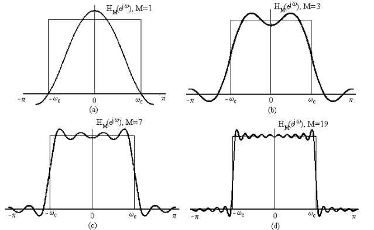

# Chapter IV: Frequency Analysis of Discrete Signals

## IV.1 Reminder: Frequency analysis of analog signals

### Introduction

* Very useful to analyze signals in **frequency domain**
* The **spectrum** of a signal indicates the frequency contents
* Mathematical tools: 
    * periodicac signals: **Fourier series**
    * non-periodical signals: **Fourier transform**
    
### Analog periodical signals

* Periodical signal:
$$x(t) = x(t + T)$$

* The fundamental frequency is $$F_0 = \frac{1}{T}$$

* **The signal can be decomposed as a sum of complex exponential
signals, with multiples of the fundamental frequency, $k F_0$**
$$x(t) = \sum_{k=-\infty}^{\infty} c_k e^{j 2 \pi k F_0 t}$$

* The coefficients $c_k$ are the **spectrum** of the signal
$$c_k = \frac{1}{T} \int_{T/2}^{T/2} x(t) e ^{- j 2 \pi k F_0 t}$$

* The coefficients $c_k$ are complex values
    * their modulus = "amplitude spectrum"
    * their phase = "phase spectrum""

### Conditions for convergence

* When is the Fourier series convergent to the signal?
    * i.e. when is the relation correct, 
    * i.e. when is the sum actually equal to $x(t)$?

* Dirichlet conditions: the sum is convergent in all continuity points if:
    1. $x(t)$ is continuous or has a finite number of discontinuities
    in any finite interval
    2. $x(t)$ has a finite number of maxima and minima in any period
    3. $x(t)$ is absolutely integrable in any period, i.e.:
    $$\int_{T} |x(t)| dt  < \infty$$
    
* Weaker condition:
    * if $x(t)$ is square summable
	$$\int_T x(t)^2 dt < \infty$$
    * then the he difference $d(t) = x(t) - \sum_{k=-\infty}^{\infty} c_k e^{j 2 \pi k F_0 t}$
    has zero energy
    * Does not guarantee *pointwise* convergence
    
### Signal spectrum

* The coefficients $c_k$ are complex numbers
* If the signal is **real** $x(t) \in \mathbb{R}$, then the $c_k$ are **even**
    * $|c_k| = |c_{-k}|$
    * $\angle c_k = - \angle c_{-k}$
    * group the terms with $c_k$ with $c_{-k}$
--> **cosine with amplitude |c_k| and phase $\angle c_k$**

* Average power of signal = energy of coefficients
$$P_T = \frac{1}{T}\int_T |x(t)|^2 = \sum_{-infty}^{\infty} |c_k|^2$$

* Interpretation of Fourier series for real signal
    * **the signal is the sum of cosine signals with frequency
    $0, F_0, 2F_0 ...$, with amplitudes $|c_k|$ and phase $\angle c_k$**

* No other frequencies appear in spectrum --> spectrum is made of "lines"

### Time-frequency duality

* Time-frequency **duality**:
    * Real signal --> Even spectrum
    * Periodic signal --> Discrete spectrum

### Analog non-periodical signals

* The signal is composed of all frequencies (inverse Fourier transform)
$$x(t) = \int_{\-infty}^{\infty} X(F) e^{j 2 \pi f t} dF$$

* The frequency content is found by the Fourier transform
$$X(F) = \int_{\-infty}^{\infty} x(t) e^{- j 2 \pi f t} dt$$

* ( Can use instead $\Omega = 2 \pi F$)

* $X(F)$ is a complex function
    * $|X(F)|$ is the amplitude spectrum
    * $\angle X(F)$ is the phase spectrum

### Conditions for convergence

* When is the Fourier series convergent to the signal?
    * i.e. when is the relation correct, 
    * i.e. when is the sum actually equal to $x(t)$?

* Dirichlet conditions: the sum is convergent in all continuity points if:
    1. $x(t)$ is continuous or has a finite number of discontinuities
    2. $x(t)$ has a finite number of maxima and minima
    3. $x(t)$ is absolutely integrable:
    $$\int_{\infty}^{\infty} |x(t)| dt  < \infty$$
    
* Weaker condition:
    * if $x(t)$ is square summable
	$$\int_{\infty}^{\infty} x(t)^2 dt < \infty$$
    * then the he difference $d(t) = x(t) - \sum_{k=-\infty}^{\infty} c_k e^{j 2 \pi k F_0 t}$
    has zero energy
    * Does not guarantee *pointwise* convergence

### Signal spectrum

* $X(F)$ is a complex function
* If the signal is **real** $x(t) \in \mathbb{R}$, then the $X(F)$ is **even**
    * $|X(F)| = |X(-F)|$
    * $\angle X(F) = - \angle X(-F)$
    * group the terms with $c_k$ with $c_{-k}$
--> **cosine with amplitude |X(F)| and phase $\angle X(F)$**

* Signal energy is the same in time and frequency domains
$$E = \int_{\infty}^{\infty} |x(t)|^2 dt = \int_{\infty}^{\infty} |X(F)|^2 dF$$

* The power spectral density of $x(t)$ is 
$$S_{xx}(F) = |X(F)|^2$$

## IV.2 Frequency analysis of discrete signals

### Fourier series of discrete periodical signals

* A discrete signal of period $N$: $x[n] = x[n + N]$

* Decomposed as a **sum of complex exponentials**:
$$x[n] = \sum_{k=0}^{N-1} c_k e^{j 2 \pi k n / N}, n=0,1,... N-1$$

* Finding the coefficients:
$$c_k = \frac{1}{N} \sum_{n=0}^{N-1} x[n] e^{- j 2 \pi k n /N}$$

### Comparison with  analog Fourier series

* Compared to analog signals:
    * consider fundamental frequency $f_0 = 1/N$
    * only $N$ terms, with frequencies $k \cdot f_0$:
        * $0, f_0, 2 f_0, ... (N-1) f_0$
    * only $N$ distinct coefficients $c_k$
    * the $N$ coefficients $c_k$ can be chosen like $- \frac{N}{2} < k  \leq \frac{N}{2}$
    => the frequencies span the range $-1/2 ... 1/2$
$$-\frac{1}{2} < f_k \leq \frac{1}{2}$$
$$-\pi < \omega_k \leq \pi$$

    
### Basic properties of Fourier coefficients

1. Signal is **discrete** --> coefficients are **periodic** with period N
$$c_{k+N} = \frac{1}{N} \sum_{n=0}^{N-1} x[n] e^{- j 2 \pi (k+N) n / N} = \frac{1}{N} \sum_{n=0}^{N-1} x[n] e^{- j 2 \pi k n / N}$$

2. If signal is real $x[n] \in \mathbb{R}$, the coefficients are **even**:
    * $c_k^* = c_{-k}$
    * $|c_k| = |c_{-k}|$
    * $\angle c_k = \angle c_{-k}$
    
* Together with periodicity:
    * $|c_k| = |c_{-k}| = |c_{N-k}|$
    * $\angle c_k = - \angle c_{-k} = - \angle c_{N-k}$

### Expressing as sum of sinusoids

* Grouping terms with $c_k$ and $c_{-k}$ we get
$$x[n] = c_0 + 2 \sum_{k=1}^L |c_k| cos(2 \pi \frac{k}{N} + \angle c_k)$$
where $L = N/2$ or $L = (N-1)/2$ depending if $N$ is even or odd

* Signal = DC value + a finite sum of sinusoids with frequencies $k f_0$
    * $|c_k|$ give the amplitudes (x 2)
    * $\angle c_k$ give the phases

### Power spectral density

* The average power of a discrete periodic signal
$$P = \frac{1}{N} \sum_{n=0}^{N-1}|x[n]|^2$$

* Is the same in the frequency domain (with proof):

$$P = \sum_{k=0}^{N-1} |c_k|^2$$

* Power spectral density of the signal is
$$S_{xx}[k] = |c_k|^2$$

* Energy over one period is
$$E = \sum_{n-0}^{N-1} |x[n]|^2 = N \sum_{k-0}^{N-1} |c_k|^2$$

### Examples

* Examples:

$$x_1[n] = cos(\sqrt{5} \pi n)$$
$$x_2[n] = 2 sin(\frac{\pi}{3}n)$$
$$x_3[n] = \left\{ 1,1,0,0 \right\}$$

### Example in Python

~~~~{.python}
>>> import numpy as np
>>> from scipy.fftpack import fft, ifft
>>> x = np.array([1.0, 1.0, 0.0, 0.0])
>>> y = 1.0/4.0 * fft(x)
>>> y
array([ 0.50+0.j  ,  0.25-0.25j,  0.00+0.j  ,  0.25+0.25j])

~~~~~~~~~~~~~

### Properties of Fourier series

#### 1. Linearity

If the signal $x_1[n]$ has the Fourier series coefficients $\lbrace c_k^{(1)} \rbrace$, 
and $x_2[n]$ has $\lbrace c_k^{(2)} \rbrace$, then their sum has 

$a \cdot x_1[n] + b\cdot x_2[n] \leftrightarrow \lbrace a \cdot c_k^{(1)} + b\cdot c_k^{(2)} \rbrace$

Proof: via definition

### Properties of Fourier series

####  2. Shifting in time

If $x[n] \leftrightarrow \lbrace c_k \rbrace$, then
$$x[n - n_0] \leftrightarrow \lbrace e^{(-j 2 \pi k n_0 / N)} c_k \rbrace$$

Proof: via definition

* The amplitudes $|c_k|$ are not affected, shifting in time affects only the phase

### Properties of Fourier series

#### 3. Modulation in time
$$e^{j 2 \pi k_0 n / N} \leftrightarrow \lbrace c_{k-k_0} \rbrace$$

#### 4. Complex conjugation

$$x^*[n] \leftrightarrow \lbrace c^*_{-k} \rbrace$$

### Properties of Fourier series

#### 5. Circular convolution

Circular convolution of two signals $\leftrightarrow$ product of coefficients

$$x_1[n] \otimes x_2[n] \leftrightarrow \lbrace N \cdot c_k^{(1)} \cdot c_k^{(2)} \rbrace$$

Circular convolution:

$$x_1[n] \otimes x_2[n] = \sum_{k=0}^{N-1} x_1[k] x_2[(n-k)_N]$$

* takes two periodic signals of period N, result is the same
* Example at the whiteboard: how it is computed

### Properties of Fourier series

#### 6. Product in time

Product in time $\leftrightarrow$ circular convolution of Fourier series coefficients
$$x_1[n] \cdot  x_2[n] \leftrightarrow \sum_{m=0}^{N-1} c_m^{(1)} c_{(k-m)_N}^{(2)} = c_k^{(1)} \otimes c_k^{(2)}$$

### Fourier transform of discrete non-periodical signals

* Non-periodical signals contain all frequencies, not only the multiples of $f_0$

* The Fourier transform of a discrete signal:
$$X(\omega) = \sum_{n=-\infty}^\infty x[n] e^{-j \omega n}$$

* The inverse Fourier transform:
$$x[n] = \frac{1}{2 \pi} \int_{-\pi}^\pi X(\omega) e^{j \omega n} d\omega$$

### Comparison

* Compared with the Fourier transform of analog signals
    * sum instead of integral in Fourier transform
    * spectrum is only in range:
    $$\omega \in [-\pi, \pi]$$
    $$f \in [-\frac{1}{2}, \frac{1}{2}]$$

* Compared with the Fourier series of discrete periodical signals
    * general $\omega$ instead of $2 \pi k f_0$
    * spectrum is continuous, not discrete 
    * integral, not sum  in inverse Fourier transform

### Parseval theorem

* **Parseval theorem**: energy of the signal is the same in time and frequency domains
$$E = \sum_{-\infty}^\infty |x[n]|^2 = \frac{1}{2 \pi}\int_{-\pi}^\pi |X(\omega)|^2$$

* Proof: on whiteboard

* The **energy spectral density** gives the energy contained for each frequency
$$S_{xx}(\omega) = |X(\omega)|^2$$

### Basic properties of Fourier transform

* It is **periodical** with period $2 \pi$
$$X(\omega + 2 \pi) = X(\omega)$$

* If the signal $x[n]$ is real, the Fourier transform is **even**
$$x[n] \in \mathbb{R} \rightarrow X^*(\omega) = X(-\omega)$$

* This means
    * modulus is even: $|X(\omega)| = |X(-\omega)|$
    * phase is odd: $X(\omega) = - X(-\omega)$

### Convergence of the Fourier transform

* When are the relations valid?

* Assume we compute the Fourier transform with only $2M+1$ samples:
$$X_M(\omega) = \sum_{-M}^M x[n] e^{- j \omega n}$$

* If a signal $x[n]$ is **absolutely summable**:
$$\sum_{\infty}^\infty |x[n]| < \infty$$

* then the Fourier series  is **uniform convergent** for every $\omega$ (OK):
$$\lim_{M \to \infty} X(\omega) - X_M(\omega) = 0$$

### Convergence for square-summable signals

* Signals that are only **square summable**
$$\sum_{\infty}^\infty |x[n]|^2 < \infty$$

* have a weaker convergence:
$$\lim_{M \to \infty} \int_{-\pi}^\pi |X(\omega) - X_M(\omega)|^2 d\omega = 0$$

### The Gibbs phenomenon

* When $H(\omega)$ **has discontinuities**, then $h[n]$ is **not** absolutely summable, only square summable

* Problem: if we only use $M$ samples, even if $M$ is very large, we will
obtain **small oscillations around the discontinuity**

* As $M \to \infty$, the oscillations do not become smaller, but thinner --> they don't go away!

* The Fourier transform will always *overshoot* with about 9% below and above 

* Known as the **Gibbs phenomenon**

### Gibbs phenomenon

### Relation between Fourier series and Fourier transform

* If apply Fourier transform to periodical discrete signals, $X(\omega)$ 
contains Diracs
* The Diracs are at frequencies $k f_0$, just like the Fourier series
* The value of an impulse = the coefficient $c_k$ of the Fourier series

* **The Fourier series $\approx$ the Fourier transform of periodic signals**
    * we directly compute the coefficients $c_k$ of the impulses in the spectrum

### Fourier transform and Z transform

* Definition of Fourier transform = Z transform with:
$$z = e^{j \omega}$$

* $e^{j \omega}$ = points on the unit circle

* Fourier transform = Z transform evaluated **on the unit circle**
    * if the unit circle is in the convergence region of Z transform
    * otherwise, equivalence does not hold

* This is true for most usual signals we work with
    * there are exceptions, but they are outside the scope of this class

### Properties of Fourier transform

#### 1. Linearity

$$a \cdot x_1[n] + b\cdot x_2[n] \leftrightarrow a \cdot X_1(\omega)+ b\cdot X_2(\omega)$$

Proof: via definition

### Properties of Fourier transform

####  2. Shifting in time

$$x[n - n_0] \leftrightarrow e^{-j \omega n_0} X(\omega)$$

Proof: via definition

* The amplitudes $|X(\omega)|$ is not affected, shifting in time affects only the phase

### Properties of Fourier transform

#### 3. Modulation in time
$$e^{j \omega_0 n} x[n]\leftrightarrow X(\omega - \omega_0)$$

#### 4. Complex conjugation

$$x^*[n] \leftrightarrow X^*(-\omega)$$

### Properties of Fourier transform

#### 5. Convolution

$$x_1[n] * x_2[n] \leftrightarrow X_1(\omega) \cdot X_2(\omega)$$

* Not circular convolution, this is the normal convolution

### Properties of Fourier transform

#### 6. Product in time

Product in time $\leftrightarrow$ convolution of Fourier transforms
$$x_1[n] \cdot  x_2[n] \leftrightarrow \frac{1}{2 \pi} \int_{-\pi}^\pi X_1(\lambda) X_2(\omega - \lambda) d\lambda$$

### Properties of Fourier transform

#### Correlation theorem

$$r_{x_1x_2}[l] \leftrightarrow X_1(\omega) X_2(-\omega)$$

#### Wiener Khinchin theorem

Autocorrelation of a signal $\leftrightarrow$ Power spectral density
$$r_{xx}[l] \leftrightarrow S_{xx}(\omega) = |X(\omega)|^2$$

### Properties of Fourier transform

#### Parseval theorem
Energy is the same when computed in the time or frequency domain

$$\sum|x[n]|^2 = \frac{1}{2 \pi} \int_{-\pi}^{\pi} |X(\omega)|^2 d\omega$$

### Relationship of Fourier transform and Fourier series

* How are they related?
    * Fourier transform: for non-periodical signals
    * Fourier series: for periodical series

* Duality: periodic in time $\leftrightarrow$ discrete in frequency

* If we **periodize** a signal $x[n]$ by repeating with period N:
$$x_N[n] = \sum_{k=-\infty}^{\infty} x[n - k N]$$

* then the Fourier transform w is discrete (made of Diracs):
$$X_N(\omega) = 2 \pi c_k \delta(\omega - k \frac{2 \pi}{N})$$

* The coefficients of the Diracs = exactly the Fourier series coefficients

### Relationship of Fourier transform and Fourier series

* So, Fourier transform can be considered for both periodic and non-periodic signals

* Fourier transform for periodic signals = discrete (sum of Diracs with some coefficients)
    * Diracs at frequencies $f_0 = 1/N$ and its multiplies

* Fourier series for periodic signals = gives the coefficients of the Diracs directly
    * it just omits to write the Diracs explicitly in the equation

### Relation of Fourier transform and Z transform

* Fourier transform: $X(\omega) = \sum_{-\infty}^{\infty}x[n] e^{-j \omega n}$
* Z transform: $X(z) = \sum_{-\infty}^{\infty}x[n] z^{-n}$

* **Fourier tranform = Z transform for $z = e^{j \omega}$**

* $z = e^{j \omega}$ means **evaluated on the unit circle**:
    * $|z| = |e^{j \omega}| = 1 (modulus)$
    * $\angle{z} = \angle{e^{j \omega}} = \omega (phase)$

* Conditions:
    * unit circle must be in the Convergence Region of Z transform
    * some signals can have Fourier transform even though unit circle not in CR

* If signal has pole on unit circle --> Dirac (infinite) in Fourier transform 
    * e.g. $u[n]$
    * some signals are non-convergent on unit circle, but have Fourier transform (e.g. $u[n]$)

### Geometric interpretation of Fourier transform

$$X(z) = C \cdot \frac{(z-z_1)\cdots(z - z_M)}{(z-p_1)\cdots(z - p_N)}$$
$$X(\omega) = C \cdot \frac{(e^{j \omega}-z_1)\cdots(e^{j \omega} - z_M)}{(e^{j \omega}-p_1)\cdots(e^{j \omega} - p_N)}$$

* Modulus:
$$|X(\omega)| = |C| \cdot \frac{|e^{j \omega}-z_1|\cdots|e^{j \omega} - z_M|}{|e^{j \omega}-p_1|\cdots|e^{j \omega} - p_N|}$$

* Phase:
$$\angle{X} = \angle{C} + \angle (e^{j \omega}-z_1) + \cdots + \angle(e^{j \omega} - z_M) - \angle(e^{j \omega}-p_1) - \cdots - \angle(e^{j \omega} - p_N)$$

### Geometric interpretation of Fourier transform

* For complex numbers:
    * modulus of $|a - b|$ = the length of the segment between $a$ and $b$
    * phase of $|a - b|$ = the angle of the segment from $b$ to $a$ (direction is important)

* So, for a point on the unit circle $z = e^{j \omega}$
    * modulus $|X(\omega)|$ is **given by the distances to the zeros and to the poles**
    * phase $\angle{X(\omega)}$ is **given by the angles from the zeros and poles to z**

### Geometric interpretation of Fourier transform

* Consequences:
    * when a **pole** is very close to unit circle --> Fourier transform is **large** at this point
    * when a **zero** is very close to unit circle --> Fourier transform is **small** at this point

* Examples:...

* Simple interpretation for modulus $|X(\omega)|$:
    * Z transform $X(z)$ is a *"landscape"*
        * poles = mountains of infinite height
        * zeros = valleys of zero height

    * Fourier transform $X(\omega)$ = "*Walking over this landscape along the unit circle*" --> the heights give the Fourier transform 

    * When close to a mountain --> road is high --> Fourier transform has large amplitude
    * When close to a valley --> road is low --> Fourier transform has small amplitude

* Enough to sketch the Fourier transform for signals with few poles/zeros

### Geometric interpretation of Fourier transform

* Note: $X(z)$ might also have a constant $C$ in front!
    * It does not appear in pole-zero plot
    * The value of $|C|$ and $\angle{C}$ must be determined separately

* This "geometric method" can be applied for both modulus and phase

### Time-frequency duality

* **Duality** properties related to Fourier transform/series

* Discrete $\leftrightarrow$ Periodic
    * **discrete** in time --> **periodic** in frequency
    * **periodic** in time --> **discrete** in frequency

* Continuous $\leftrightarrow$ Non-periodic
    * **continous** in time --> **non-periodic** in frequency
    * **non-periodic** in time --> **continuous** in frequency

### Frequency-based classification of signals

* Based on frequency content:
    * **low-frequency** signals
    * **mid-frequency** signals (band-pass)
    * **high-frequency** signals

* **Band-limited** signals: spectrum is 0 over some frequency $f_{max}$
* **Time-limited** signals: signal value is 0 outside some time interval

* **Bandwitdh** $B$: frequency interval [$F_1$, $F_2$] which contains $95\%$ of energy
    * $B = F_2 - F_1$

* Based on bandwidth $B$:
    * **Narrow-band** signals: $B << $ central frequency $\frac{F_1 + F_2}{2}$
    * **Wide-band** signals: not narrow-band
