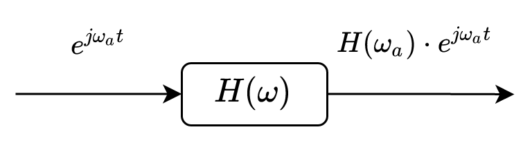
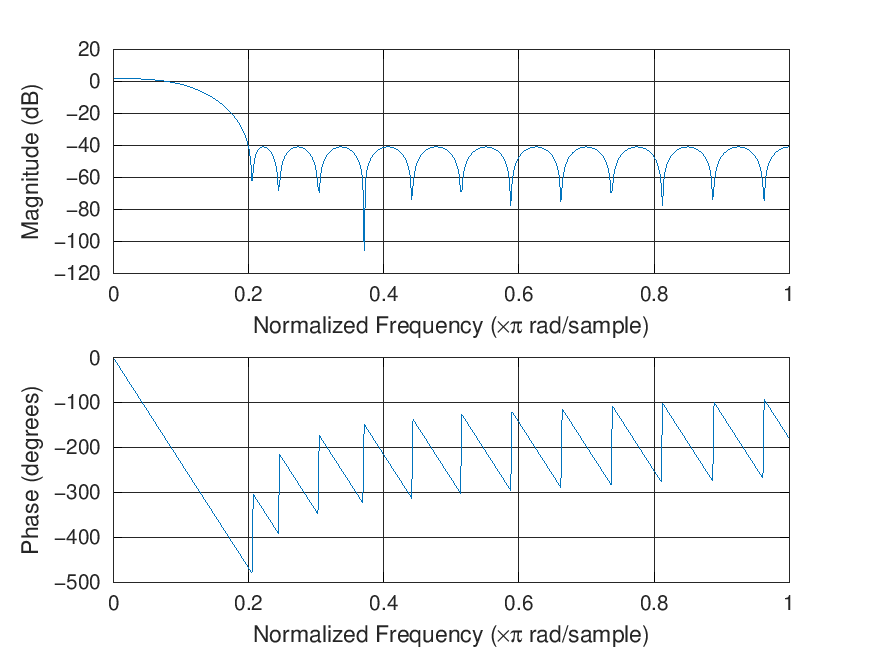
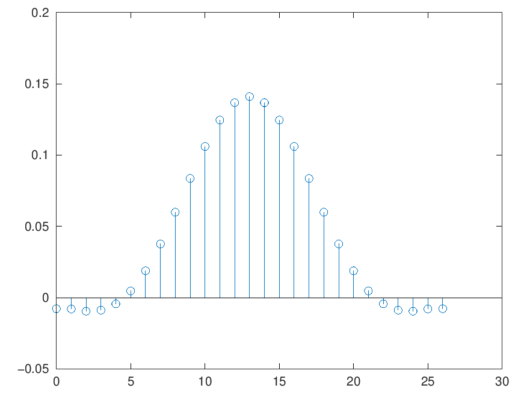
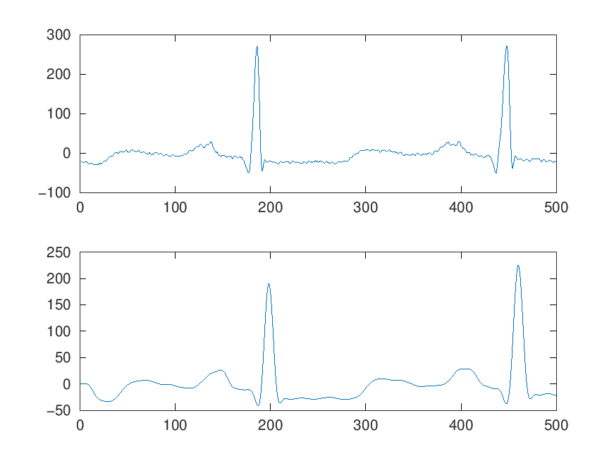
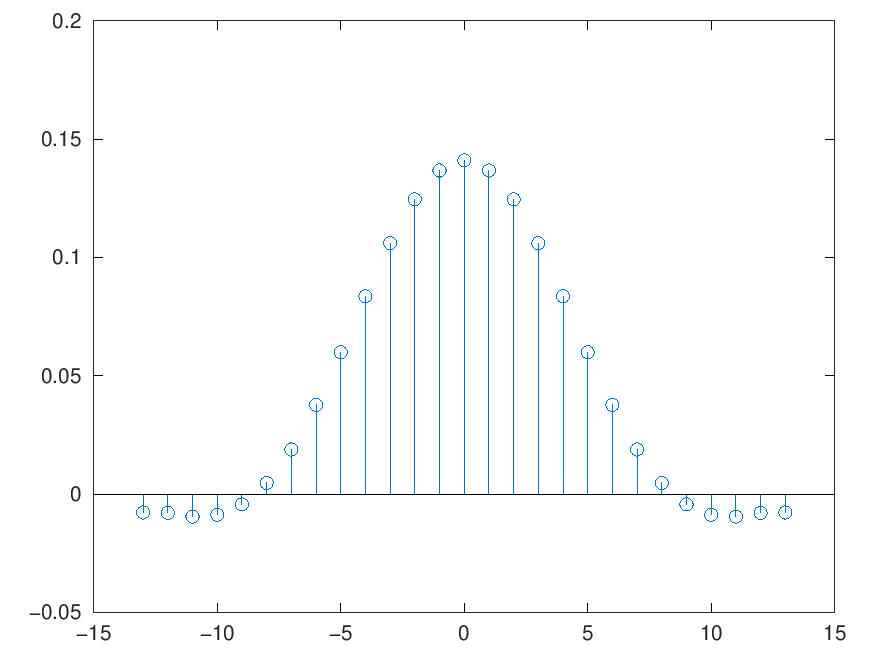
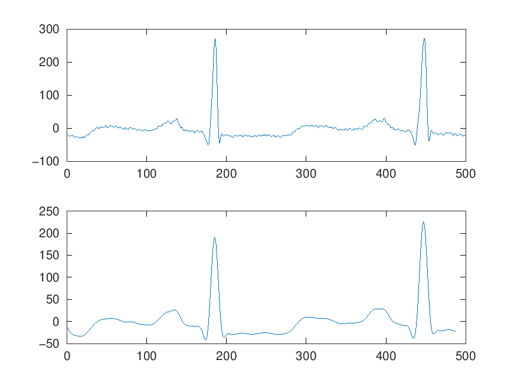

# Chapter V. Digital filtering

### Response of LTI systems to harmonic signals

- We consider an LTI system with $h[n]$

- Input signal = complex harmonic (exponential) signal
$x[n] = A e^{j \omega_0 n}$

- Output signal = convolution
$$\begin{split}
y[n] &= \sum_{k=-\infty}^\infty h[k] x[n-k]\\
&= \sum_{k=-\infty}^\infty h[k] e^{-j \omega_0 k} A e^{j \omega_0 n}\\
&= H(\omega_0) \cdot x[n]
\end{split}$$

- $H(\omega_0)$ = Fourier transform of $h[n]$ evaluated for $\omega = \omega_0$

### Response of LTI systems to harmonic signals

- $H(\omega)$ = Fourier transform of $h[n]$ evaluated for $\omega$ = **transfer function**

### Eigen-function

- Complex exponential signals are **eigen-functions** (funcții proprii)
of LTI systems:

   - output signal = input signal $\times$ a (complex) constant

- $H(\omega_0)$ is a constant that multiplies the input signal

   - Amplitude of input gets multiplies by $|H(\omega_0)|$
   - Phase of input signal is added with $\angle H(\omega_0)$

- Why are sin/cos/exp functions important?

   - If input signal = sum of complex exponential (like coses + sinuses),
   - then output = same sum of complex exponentials, each scaled with some coefficients

### Response to cosine and sine

- Cosine / sine = sum of two exponentials, via Euler
  $$\cos(\omega n) = \frac{e^{j \omega n} + e^{-j \omega t}}{2}$$
  $$\sin(\omega n) = \cos(\omega n - \frac{\pi}{2})$$

- System is linear and real => 
  
    - amplitude is multiplied by $|H(\omega_0)|$
    - phase increases by $\angle H(\omega_0)$

- See proof at blackboard

### Frequency response

- Naming:

    - $H(\omega)$ = **frequency response** of the system
    - $|H(\omega)|$ = **amplitude response** (or magnitude response)
    - $\angle H(\omega)$ = **phase response**

- Magnitude response is non-negative: $|H(\omega)| \geq 0$

- Phase response is an angle: $\angle H(\omega) \in (-\pi, pi]$
    
    - Phase response may have jumps of $2 \pi$ (wrapped phase)
    - Stitching the pieces in a continuous function = phase *unwrapping*
    - Unwrapped phase: continuous function, may go outside interval $(-\pi, pi]$
    - Example: at blackboard

### Permanent and transient response

- Warning: $\cos(\omega n)$ does not start at $n = 0$

- The above harmonic signals start at $n = -\infty$.

- What's wrong if the signal starts at some time $n$?

### Permanent and transient response

- What if the signal starts at some time $n$?

- Total response = transient response + permanent response

    - transient response  goes towards 0 as $n$ increases
    - permanent response = what remains

- So the above relations are valid only in **permanent regime**

    - i.e. after the transient regime has passed
    - i.e. after the transient response has practically vanished
    - i.e. when the signal started very long ago (from $n = -\infty$)
    - i.e. when only the permanent response remains in the output signal

- Example at blackboard

### Permanent response of LTI systems to periodic inputs

- Consider an input $x[n]$ which is periodic with period N

- Then it can be represented as a Fourier series with coefficients $c_k$:
$$x[n] = \frac{1}{N} \sum_{k=0}^{N-1}c_k e^{j 2 \pi k n / N}$$

- Since the system is linear, each component $k$ gets multiplied with $H\left(\frac{2 \pi}{N}k\right)$

- So the total output is:
$$y[n] = \frac{1}{N}\sum_{k=0}^{N-1}c_k H\left(\frac{2 \pi}{N}k\right) e^{j 2 \pi k n / N}$$

- The output is still periodic, same period, same frequencies

### Response of LTI systems to non-periodic signals

- Consider a general input $x[n]$ (not periodic)

- The output = input convolution with impulse response

  $$y[n] = x[n] * h[n]$$

  $$Y(\omega) = X(\omega) \cdot H(\omega)$$

- Output spectrum = Input spectrum $\times$ Transfer function

### Response of LTI systems to non-periodic signals

- The transfer function $H(\omega)$ "shapes" the spectrum

$$Y(\omega) = X(\omega) \cdot H(\omega)$$

- In polar form:

    - modulus is multiplied
        
        $$|Y(\omega)| = |X(\omega)| \cdot |H(\omega)|$$
    
    - phases is added:
    
        $$\angle{Y(\omega)} = \angle{X(\omega)} + \angle{H(\omega)}$$

### Response of LTI systems to non-periodic signals

- The system **attenuates/amplifies** the input frequencies and **changes their phases**

- $H(\omega)$ = the **transfer function**
- $H(z)$ = the **system function**
- $H(\omega) = H(z=e^{j\omega})$ if unit circle is in CR

### Power spectral density

- $S_{zz}(\omega) = |Y(\omega)|^2 = |H(\omega)|^2 \cdot S_{xx}(\Omega)$ 

- The poles and zeros of $S(\omega)$ come in pairs ($z, 1/z$ and $p, 1/p$)

### Digital filters

- LTI systems are also known as **filters** because their transfer function shapes ("filters") the frequencies of the input signals

- The transfer function can be found from $H(z)$ and $z = e^{j \omega}$

- Alternatively, the transfer function can be found by the **geometrical method** based on the locations of poles and zeros

### Ideal filters

- Draw at whiteboard the ideal transfer function of a:

  - low-pass filter
  - high-pass filter
  - band-pass filter
  - band-stop filter
  - all-pass filter (*changes the phase*)

### Filter order

- The **order** of a filter = maximum degree in numerator or denominator of $H(z)$
    - i.e. largest power of $z$ or $z^{-1}$

- Any filter can be implemented, in general, with this number of unit delay blocks ($z^{-1}$)

- Higher order -> better filter transfer function

    - closer to ideal filter
    - more complex to implement
    - more delays (bad)

- Lower order

    - worse transfer function (not close to ideal)
    - simpler, cheaper
    - faster response

### Filter design by pole and zero placements

- Based on geometric method

- The gain coefficient must be found by separate condition
    - i.e. specify the desired magnitude response at one frequency

- Examples at blackboard

### Filter distortions

- When a filter is non-ideal:

    - non-constant amplitude --> amplitude distortions
    - non-linear phase --> phase distortions

- Phase distortions may be tolerated by certain applications

    - e.g. human auditory system is largely insensitive to phase distortions of sounds

### Effect of system's phase

- What is the effect of system's phase response $\angle{H(\omega)}$?

- Extra phase = delay

   - different frequencies are delayed differently
   - phase 
   
- **Linear-phase** filter: delays all frequencies 
  with the same amount of time 
   
   - i.e. the whole signal is delayed, but otherwise not distorted

   - otherwise, we get distortions
   
### Linear-phase filters

- For a sinusoidal signal, extra phase of $2 \pi$ = delay of a period $N = \frac{1}{f}$

- To ensure same delay for all frequencies (in time), 
  the phase $\angle H(\omega)$ must be proportional to the frequency
  
    - draw at blackboard
    - hence the name **linear**
 
### Linear-phase filters

- Example: consider the following filter with **linear phase** function:
    $$H(\omega) = C \cdot e^{- j \omega n_0}$$

- The output signal is
    $$Y(\omega) = X(\omega) \cdot C \cdot  e^{- j \omega n_0}$$

    $$y[n] = C \cdot x[n-n_0]$$

- Linear phase means **just a delaying** of the input signal
    
    - Fourier property: $x[n-n_0] <--> X(\omega) e^{-j \omega n_0}$

### Group delay

- Group delay = The time delay experienced by a component of frequency $\omega$ when passing through the filter

  - as opposed to "phase delay" = the phase added by the filter

- **Group delay** of the filter:
$$\tau_g(\omega) = \frac{d \Theta(\omega)}{d \omega}$$

- Linear phase = constant group delay = all frequencies delayed the same = whole  signal delayed

### Linear-phase FIR filters

What type of filters can have linear phase?

- IIR filters cannot have linear phase (no proof provided) 

- Only FIR filters can have linear phase, and only if they satisfy some symmetry conditions

### Symmetry conditions for linear-phase FIR

- Let filter have an impulse response of length $M$ (order is $M-1$)

- The filter coefficients are $h[0]$, ... $h[M-1]$

- Linear-phase is guaranteed in two cases

    - **Positive symmetry**
        $$h[n] = h[M-1-n]$$

    - **Negative symmetry (anti-symmetry)**
        $$h[n] = -h[M-1-n]$$

- The delay = the delay of the middle point of the symmetry

### Cases of linear-phase FIR

- Proofs at blackboard

1. Positive symmetry, M = odd
2. Positive symmetry, M = even
3. Negative symmetry, M = odd
4. Negative symmetry, M = even

- Check constraints for $H(0)$ and $H(\pi)$
- For what types of filters is each case appropriate?

### Proof example

Linear-phase proof for a FIR system with positive symmetry, M = odd

- Only for an example, it is simpler (general case at blackboard)

- Suppose we have a FIR filter with $M=5$ coefficients:
  $$h[n] = \lbrace 4, 3, 2, 3, 4 \rbrace$$
  $$H(z) = 4 + 3 z^{-1} + 2 z^{-2} + 3z^{-3} + 4z^{-4} $$

- having positive symmetry  (first = last, second = second to last, etc)

- and length $M$ = odd, i.e. one coefficient is alone in the middle

### Proof example

- Let's compute $H(\omega)$:

$$\begin{aligned}
H(\omega) &= \sum_n h[n] e^{- j \omega n} \\
&= 4 e^0 + 3 e^{-j \omega} + 2 e^{-j 2 \omega} + 3 e^{-j 3 \omega} + 4 e^{-j 4 \omega}\\
&= e^{-j 2 \omega} (4 e^{j 2 \omega} + 3 e^{j \omega} + 2 + 3 e^{-j 1 \omega} + 4 e^{-j 2 \omega} ) \\
&= e^{-j 2 \omega} (4 e^{j 2 \omega} + 4 e^{-j 2 \omega} + 3 e^{j \omega} + 3 e^{-j 1 \omega} + 2) \\
&= e^{-j 2 \omega} (4 \cdot 2 \cos(2 \omega) + 3 \cdot 2 \cos(\omega) + 2 ) \\
&= \underbrace{    e^{j \angle{H(\omega)}}   }_{e^{j \cdot phase}} \underbrace{|H(\omega)|}_{real} \\
\end{aligned}$$

- The phase is $\angle(H(\omega)) = - 2 \omega$, a **linear** function
- The phase of the filter is linear

### Proof explained

Key points in this proof:

- we pull a common factor, so that the first and last terms have the same exponents, but with opposite signs
- we group first with last term, second with second-to-last:
  - they have same coefficient in front, because of positive symmetry
  - $e^{jx} + e^{-jx} = 2 \cos(x) = real$
- everything remaining in the right-side paranthesis is a real-valued

Since $H(\omega) = |H(\omega)| e^{j\angle{H(\omega)}}$, we identify the two terms:

- $|H(\omega)|$ must be the real part in the right-side
- $\angle{H(\omega)}$ must be the term $-2\omega$, which is a linear function of $\omega$
(up to some changes in sign of the real part)

### Other cases

Generalizations:

- the filter length can be anything, as long as it has symmetry
- if $M$ is even, there is no single term remaining in the middle, but the proof stays the same
- if we have **negative** symmetry, the terms have opposite signs, and we use: 
  $$e^{jx} - e^{-jx} = 2 j \sin(x) = 2 \sin(x) \cdot e^{j \frac{\pi}{2}}$$

### Zero-phase FIR filters

- Can we avoid delay altogether?

- **Zero-phase** filter = a particular type of linear-phase filter with zero delay

- For a zero-phase filter, the phase response $\angle H(\omega) = 0$

  - (Group) delay = derivative of $\angle{H(\omega)}$
  - delay 0 $\Leftrightarrow$ flat $\angle{H(\omega)}$ $\Leftrightarrow$ $\angle H(\omega) = 0$
  
- Delay is 0 $\Leftrightarrow$ symmetry with respect to $h[0]$

  - the system cannot be causal
  
### Zero-phase FIR filters

- Zero-phase filters must be non-causal
  
  - left side of $h[n]$ symmetrical to right side of $h[n]$

- For causal, we need to delay $h[n]$ to be wholly on the right side => delay

### Example

- Linear-phase filter (low-pass):

{height=70%}

### Example

- The impulse response (positive symmetry):

{height=70%}

### Example

- ECG signal: original and filtered. Filtering introduces **delay**

{height=70%}

### Example

- Solution: zero-phase filter (positive symmetry, and centered in 0):
- But filter is **not causal** anymore

{height=65%}

### Example

- Filtering with zero-phase filter introduces **no delay**

{height=70%}

### Particular classes of filters

- **Digital resonators** = very selective band pass filters

    - poles very close to unit circle
    - may have zeros in 0 or at 1/-1

- **Notch filters**

    - have zeros exactly on unit circle
    - will completely reject certain frequencies
    - has additional poles to make the rejection band very narrow

- **Comb filters**

    - = periodic notch filters

### Digital oscillators

- **Oscillator** = a system which produces an output signal even in absence of input

- Has a pair of complex conjugate poles **exactly on unit circle**

- Example at blackboard

### Inverse filters

- Sometimes is necessary to **undo** a filtering
    - e.g. undo attenuation of a signal passed through a channel

- Inverse filter: has inverse system function:
$$H_I(z) = \frac{1}{H(z)}$$

- Problem: if $H(z)$ has zeros outside unit circle, $H_I(z)$ has poles
  outside unit circle --> unstable

- Examples at blackboard
