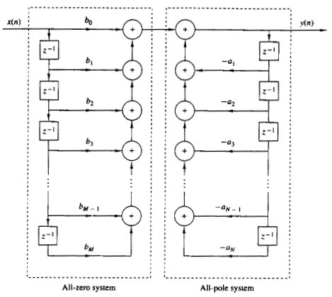

# Chapter VI. Implementation of Digital Systems

## VI.1. Direct-Form structures

### Structures for implementation

* We will see different methods of implementing systems
    * mostly LTI systems
    
* Differences
    * computational complexity (number of operations)
    * memory requirements
    * finite-precision effects
    * flexibility
    
* Block diagrams (structures)
    * can be implemented either in HW or SW
    
### Direct-Form I

* A LTI system is described by the difference equation
$$\begin{split}
y[n] =& -\sum_{k=1}^N a_k y[n-k] + -\sum_{k=1}^M b_k x[n-k] \\
=& -a_1 y[n-1] - a_2 y[n-2] -... - a_N y[n-N] + b_0 x[n] + b_1 x[n-1] + ... + b_M x[n-M]
\end{split}$$

* **Direct-Form I** structure = directly implementing this equation 

* Main disadvantage: too many delay blocks (approx. $2x$ filter order)

### Direct-Form I

{#id .class width=55%}

*[image from "Digital Signal Processing", Proakis & Manolakis, 3rd ed.]*

### Direct-Form II

* Swap the two halves of a Direct-Form I structure
    * (convolution is commutative)

* Advantage: number of delay blocks = filter order

* Is not straightforwardly related to the difference equation

* Known as Direct-Form II or **canonical form**

### Direct-Form II

{#id .class width=55%}

*[image from "Digital Signal Processing", Proakis & Manolakis, 3rd ed.]*

### Transposed forms

* **Transposition of a graph** = reverse the direction of all branches, swap input and output

* Theorem: If a structure is transposed, the transfer function stays the same
    * summing nodes become branching nodes
    * branching nodes become sum nodes

* Direct-Form I and II **Transposed**
    * transpose the form 
    * different structures than the originals

### FIR systems

* For FIR systems, $a_i = 0$ so the graphs become simpler

* There is a single Direct-Form, and a single Direct-Form Transposed

### Cascade and parallel implementations

* If a system function $H(z)$ can be written as a **sum** of smaller parts,
the system can be implemented in a **parallel structure**
    * implement each smaller part
    * same input, sum the outputs

* If a system function $H(z)$ can be written as a **product** of smaller parts,
the system can be implemented in a **cascade structure** (or **series**)
    * implement each smaller part, connect in series
    * order does not matter

### Cascade and parallel implementations

* A system function $H(z)$ can always be written as a sum of **partial fractions**
    * a parallel implementation is always possible

* A system function $H(z)$ can always be written as a product of $\frac{(z-z_k)}{(p-p_k)}$ terms
    * a series implementation is always possible

* To avoid complex-number coefficients, must group conjugate zeros and conjugate poles together
    * resulting in polynomials of degree 2

### Second-order sections

* In practice, due to finite-precision calculations, small rounding errors may appear
in coefficients or signal values

* The **most robust** implementation to these errors is the **series implementation**
    * using as many terms as possible
    * but always keeping conjugate zeros and conjugate poles together

* **Second-order sections** structure = implementation as a series of small systems of degree at most 2
    * very robust to finite-precision errors
